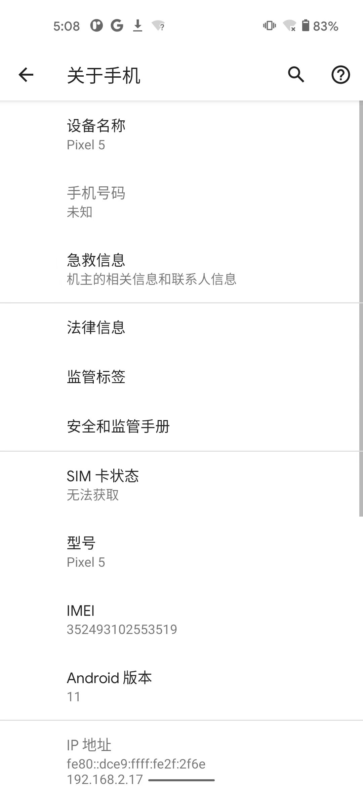
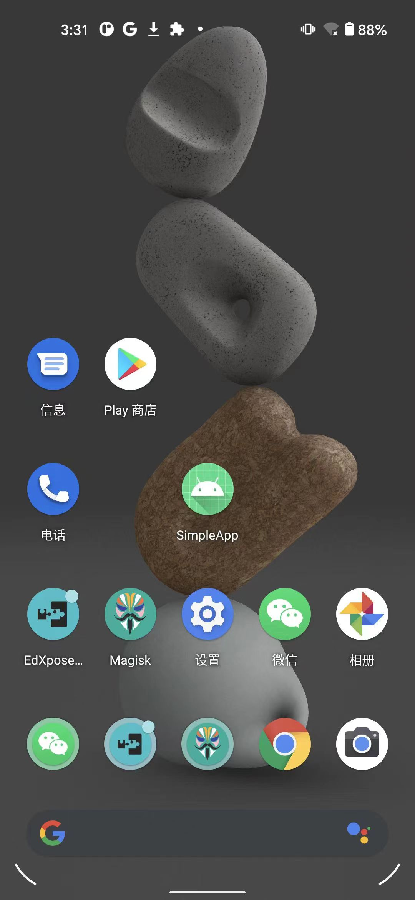

# Xposed插件开发

TODO：

* 【未解决】用FDex2核心源码开发出可以正常安装的安卓apk的XPosed插件
* 【记录】参考和翻译XPosed的官网关于如何开发XPosed插件的文档
* 【记录】确保Android Studio能用Nox安卓模拟器设备去调试
* 
* 【已解决】Android Studio中实现一个空功能的基本的安卓apk
* 【未解决】给安卓应用中新增一个按钮和点击按钮改变文字
* 【已解决】安卓app开发：新增一个按钮并设置文字和点击响应事件函数
* 
* 【记录】Nox夜神模拟器中查看已安装的Xposed插件的安卓应用
* 【已解决】把XPosed插件的安卓apk安装到Nox夜神安卓模拟器中
* 【记录】确认XPosed插件生效正常工作输入期望log日志信息
* 【已解决】研究XPosed Installer的log日志
* 【记录】给XPosed插件版本号增加为1.1且用AS重新调试安装
* 【已解决】XPosed插件报错：java.lang.IllegalAccessError Class ref in pre-verified class resolved to unexpected implementation
* 【未解决】Android Studio中如何调试XPosed插件
* 【无需解决】把XPosed插件的安卓apk安装到普通安卓AVD模拟器中
* 【未解决】Android Studio调试Xposed插件报错：Waiting for application to come online
* 【未解决】研究安卓设备的设置中的选择调试应用和等待调试器的含义和用法
* 【未解决】AS中调试外部app显示所有进程看不到我们的Xposed插件的app的进程
* 【未解决】Mac中其他好用且能安装Xposed框架的安卓模拟器
* 
* 【记录】下载和研究Xposed的XposedTools源码
* 【未解决】Mac中自己去编译x86_64的sdk23的Xposed框架zip安装包
* 【未解决】换XPosed插件开发所需的安卓模拟器从Nox夜神换为网易Mumu

---

此处环境：

* 电脑：`Mac`
  * 已安装`Android Studio`
  * 可用adb查看到安卓设备
    ```bash
    ➜  ~ adb devices -l
    List of devices attached
    9C181A8D3C3F3B         device usb:1048576X product:redfin model:Pixel_5 device:redfin transport_id:3
    ```
* 安卓手机：`Google Pixel 5`
  * `Android 11`
    * 
  * 已root，已安装：`EdXposed`、`Magisk`
    * 

下面介绍，如何开发一个最基本的**Xposed插件**：

* 用AndroidStudio创建基本的安卓app项目
* 改动项目，增加Xposed相关配置
  * 其中包括写Xposed插件代码
* 编译并安装Xposed的插件apk到安卓手机
* 确认Xposed插件的apk已安装，并测试插件是否生效
