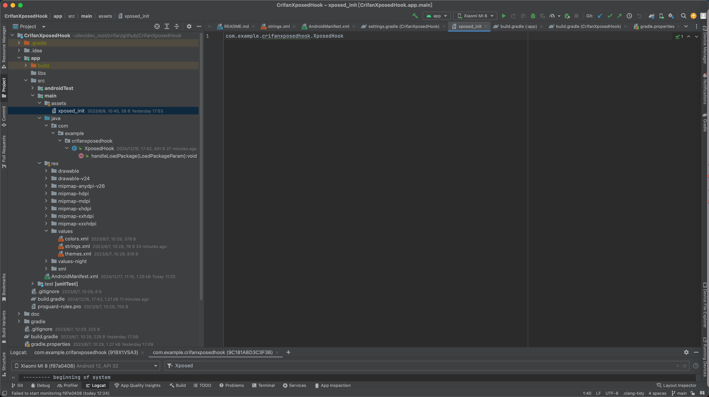
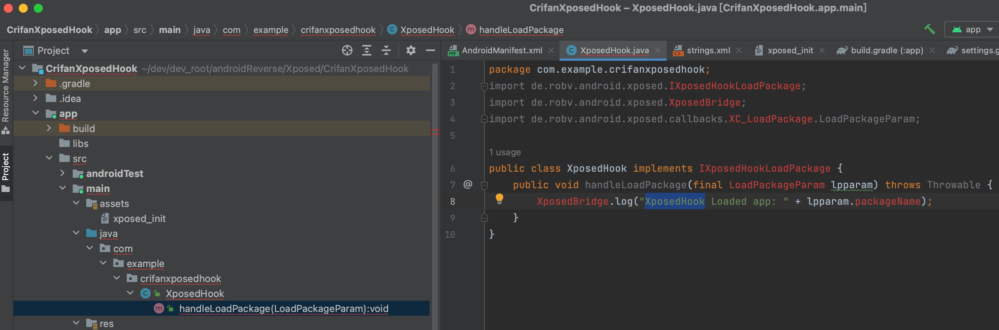
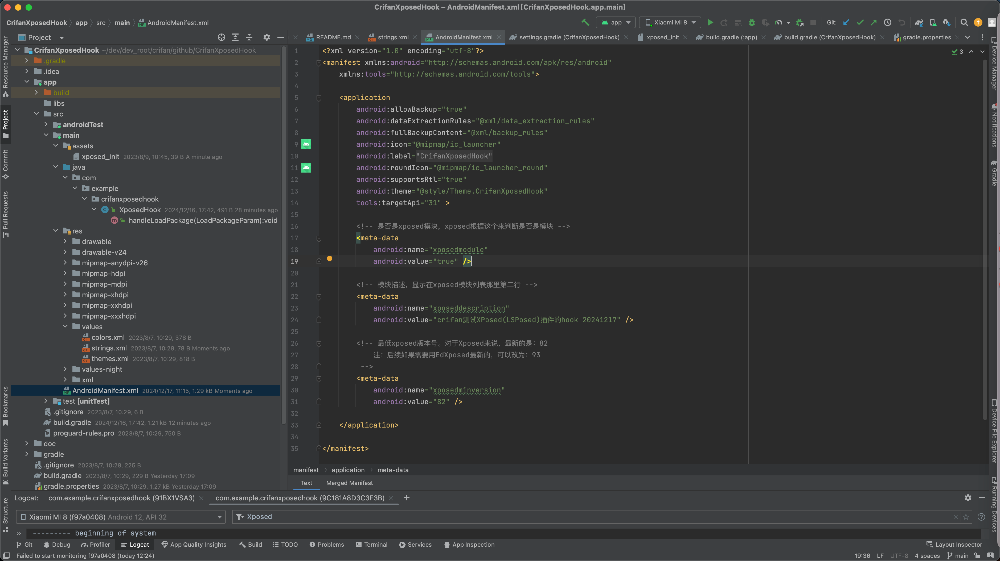
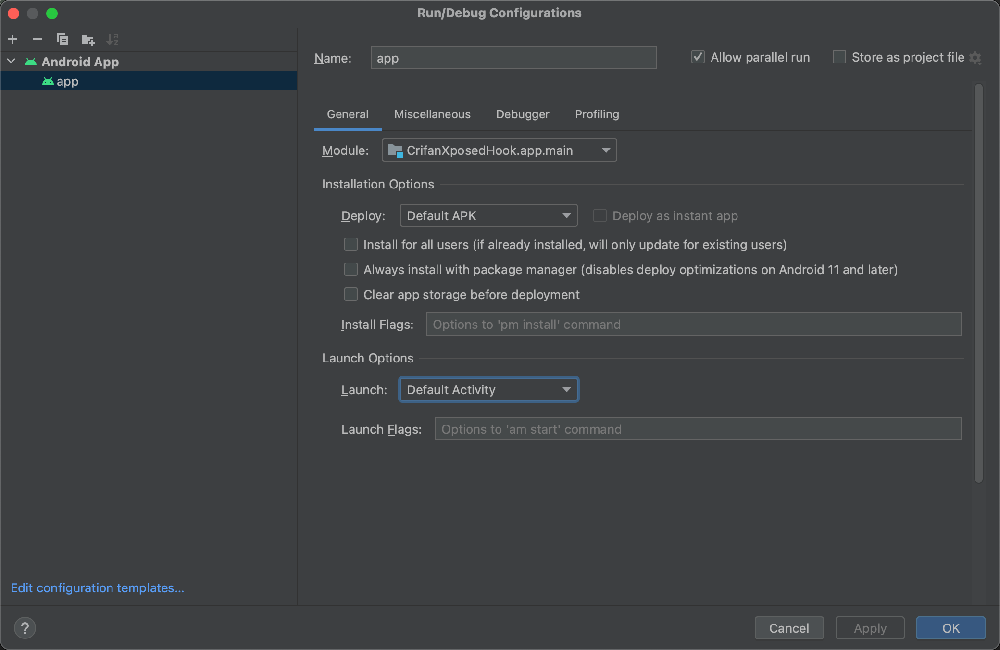
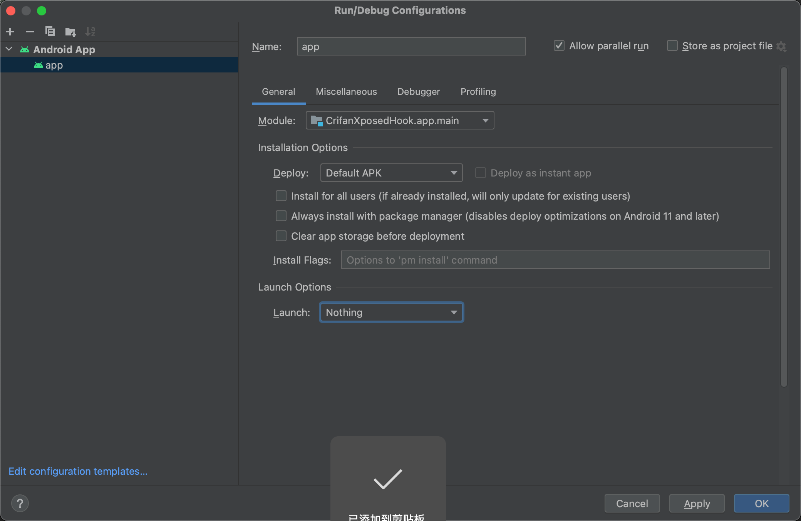
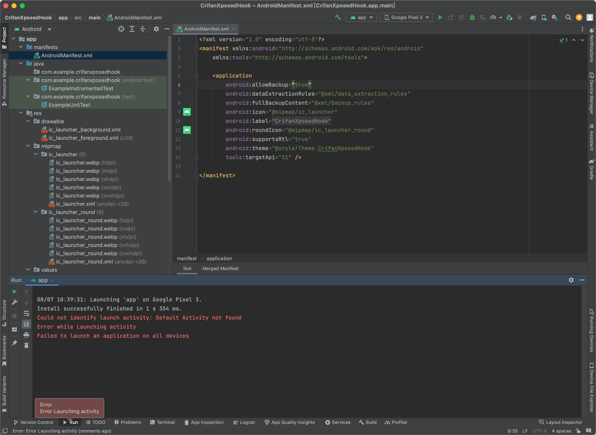
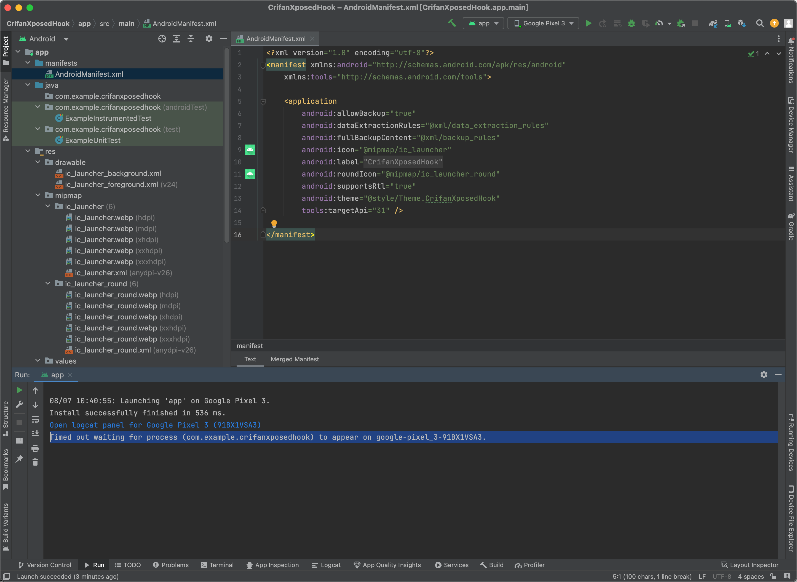
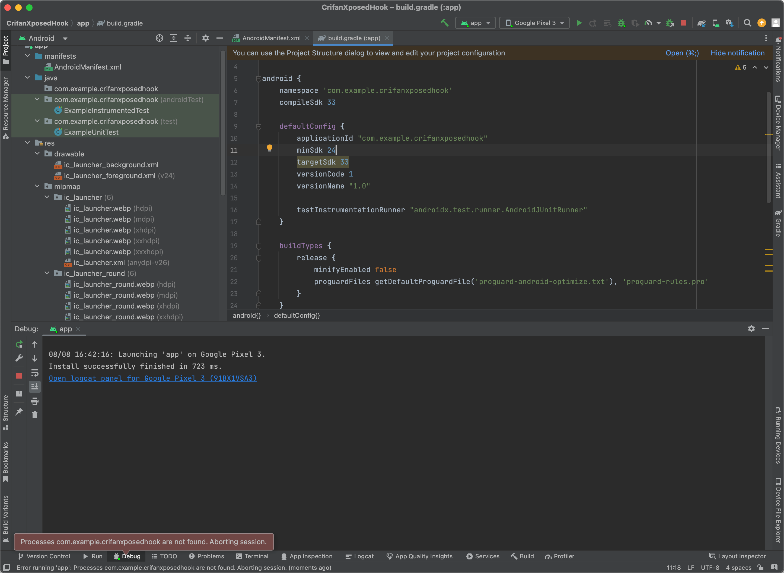
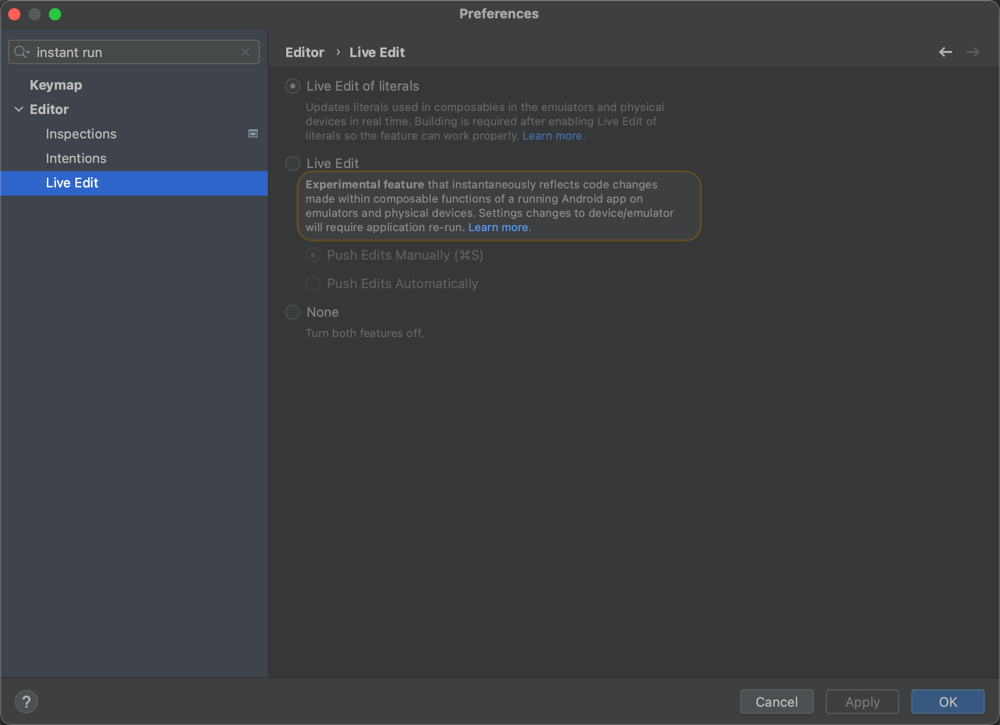

# 改动项目，增加Xposed相关配置

## 新增改动或文件

### 新建xposed_init

新建文件：`app/src/main/assets/xposed_init`

目的：定义插件hook代码所在的类

文件内容：

```c
com.example.crifanxposedhook.XposedHook
```



内容说明：

* `com.example.crifanxposedhook.XposedHook`
    * 是后续的具体的hook插件代码对应的Java的类

### 新建hook的Java类文件：XposedHook.java

新建hook代码文件：`app/src/main/java/com/example/crifanxposedhook/XposedHook.java`

目的： 实现hook代码逻辑

文件内容：

```java
package com.example.crifanxposedhook;
import de.robv.android.xposed.IXposedHookLoadPackage;
import de.robv.android.xposed.XposedBridge;
import de.robv.android.xposed.callbacks.XC_LoadPackage.LoadPackageParam;

public class XposedHook implements IXposedHookLoadPackage {
    public void handleLoadPackage(final LoadPackageParam lpparam) throws Throwable {
        XposedBridge.log("XposedHook Loaded app: " + lpparam.packageName);
    }
}
```



* 代码说明
  * 无需理会报错：`Cannot resolve symbol IXposedHookLoadPackage`
    * 基本上确定是`Android Studio`的bug？
  * 如果后续忘了加上`jcenter()`，则此处会报错找不到类：`Cannot resolve symbol de`
    * 需要记得加上`jcenter()`，详见后续内容

### 本身已有app名称定义：strings.xml

本身已有：`app/src/main/res/values/strings.xml`

文件内容：

```xml
<resources>
    <string name="app_name">CrifanXposedHook</string>
</resources>
```


* 内容说明
  * 其中`CrifanXposedHook`是当前app名称=Xposed插件名称=安卓项目名称

### 给AndroidManifest.xml中加上xposed相关定义

改动：`app/src/main/AndroidManifest.xml`

目的：新增Xposed相关配置 -> 让EdXposed等Xposed框架可以识别此（安卓的app是）Xposed插件

核心改动：修改`application`的部分属性，并加上`meta-data`的`Xposed`相关属性

改动后的：

文件内容：

```xml
<?xml version="1.0" encoding="utf-8"?>
<manifest xmlns:android="http://schemas.android.com/apk/res/android"
    xmlns:tools="http://schemas.android.com/tools">

    <application
        android:allowBackup="true"
        android:dataExtractionRules="@xml/data_extraction_rules"
        android:fullBackupContent="@xml/backup_rules"
        android:icon="@mipmap/ic_launcher"
        android:label="@string/app_name"
        android:roundIcon="@mipmap/ic_launcher_round"
        android:supportsRtl="true"
        android:theme="@style/Theme.CrifanXposedHook"
        tools:targetApi="31" >

        <!-- 是否是xposed模块，xposed根据这个来判断是否是模块 -->
        <meta-data
            android:name="xposedmodule"
            android:value="true" />

        <!-- 模块描述，显示在xposed模块列表那里第二行 -->
        <meta-data
            android:name="xposeddescription"
            android:value="crifan测试XPosed插件hook" />

        <!-- 最低xposed版本号。对于Xposed来说，最新的是：82
            注：后续如果需要用EdXposed最新的，可以改为：93
         -->
        <meta-data
            android:name="xposedminversion"
            android:value="82" />
    </application>

</manifest>
```



* 参数说明
  * `xposedmodule`=`true`
    * 表示是Xposed插件=Xposed模块
  * `xposeddescription`=`crifan测试XPosed插件hook`
    * 插件描述，会显示=出现在Xposed模块列表中的文字描述部分
   * `xposedminversion`=`82`
    * 表示：`Xposed Framework API`=`Xposed框架的API版本`
      * 此处值：82
        * 最新的Xposed框架的API版本就是82
          * 不过其实也是好多年前了（好像是2016年，当前此刻是2023年）
        * 对应支持Android版本：`> Android 5.0`
          * 对于后续要测试的安卓手机的安卓版本（`Android 8.1`，`Android 11`，`Android 13`）等，完全满足此要求
      * 可选值=所有版本：`36`、`37`、`39`、`42`、`50`、`51`、`52`、`53`、`60`、`63`、`65`、`81`、`82`
        * 详见：[IXposedHookLoadPackage | Xposed Framework API](https://api.xposed.info/reference/de/robv/android/xposed/IXposedHookLoadPackage.html)
      * 另外最好：去你的安卓手机中确认当前Xposed的API版本
        * 比如
          * 此处的Pixel5中，EdXposed首页中的：v93.0
            * 
              * 表示用的是，更加新的93的EdXposed的Xposed的API版本
              * 注：更新的API版本，支持其他更新的API接口
                * 但是同时会兼容旧版本Xposed的API接口的
          * 如果是之前旧的`Android 4.4`的安卓手机，则往往Xposed的API版本写的是`54`，测试就要此处设置为
            * `xposedminversion=53`
              * 表示支持 `<= Android 5.0`，因为支持`Android 4.x`的Xposed的API版本是`54`

#### 附录：旧版本Xposed插件的`app/src/main/AndroidManifest.xml`配置

另外贴出，之前，针对于旧版本`Android 4.4`的安卓手机

* 当时是`Android 4.4.2`的`Nox夜神模拟器`
  * 
  * 对应adb连接并查看设备
    ```bash
    crifan@licrifandeMacBook-Pro  ~  adb connect 127.0.0.1:62001
    connected to 127.0.0.1:62001
    crifan@licrifandeMacBook-Pro  ~  adb devices
    List of devices attached
    127.0.0.1:62001    device
    ```

的`src/main/AndroidManifest.xml`的配置：

```xml
<manifest xmlns:android="http://schemas.android.com/apk/res/android"
    xmlns:tools="http://schemas.android.com/tools"
    package="com.crifan.crifanxposedmodule">

    <!--android:debuggable="true"-->
    <!--tools:ignore="HardcodedDebugMode"-->
    <!--android:exported="true"-->

    <application
        android:allowBackup="true"
        android:icon="@mipmap/ic_launcher"
        android:label="@string/app_name"
        android:roundIcon="@mipmap/ic_launcher_round"
        android:supportsRtl="true"
        android:theme="@style/AppTheme"
    >
        <!-- 是否是xposed模块，xposed根据这个来判断是否是模块 -->
        <meta-data
            android:name="xposedmodule"
            android:value="true" />

        <!-- 模块描述，显示在xposed模块列表那里第二行 -->
        <meta-data
            android:name="xposeddescription"
            android:value="crifan测试XPosed模块开发" />

        <!-- 最低xposed版本号。用最新的：82
            详见：
                https://github.com/rovo89/XposedBridge/wiki/Using-the-Xposed-Framework-API
                https://github.com/rovo89/XposedBridge/wiki/Development-tutorial
                https://raw.githubusercontent.com/rovo89/XposedBridge/art/app/doclib/api/changelog.txt
            但会报错：该模块需要较新版本的XposedBridge（82），因此无法激活
            所以还是改为 53
         -->
        <meta-data
            android:name="xposedminversion"
            android:value="53" />

    </application>
</manifest>
```

供参考。

### 给`app/build.gradle`中加上xposed包的依赖

改动文件：`app/build.gradle`

目的：让Gradle下载相关xposed的jar包（和相关源码）

核心改动：加上：

```bash
        versionName "2023.08.09.01"

    compileOnly 'de.robv.android.xposed:api:82'
    compileOnly 'de.robv.android.xposed:api:82:sources'
```

改为：

`app/build.gradle`

```json
plugins {
    id 'com.android.application'
}

android {
    namespace 'com.example.crifanxposedhook'
    compileSdk 33

    defaultConfig {
        applicationId "com.example.crifanxposedhook"
        minSdk 24
        targetSdk 33
        versionCode 1
        versionName "2023.08.09.01"

        testInstrumentationRunner "androidx.test.runner.AndroidJUnitRunner"
    }

    buildTypes {
        release {
            minifyEnabled false
            proguardFiles getDefaultProguardFile('proguard-android-optimize.txt'), 'proguard-rules.pro'
        }
    }
    compileOptions {
        sourceCompatibility JavaVersion.VERSION_1_8
        targetCompatibility JavaVersion.VERSION_1_8
    }
}

dependencies {
    implementation 'androidx.appcompat:appcompat:1.6.1'
    implementation 'com.google.android.material:material:1.9.0'
    testImplementation 'junit:junit:4.13.2'
    androidTestImplementation 'androidx.test.ext:junit:1.1.5'
    androidTestImplementation 'androidx.test.espresso:espresso-core:3.5.1'

    compileOnly 'de.robv.android.xposed:api:82'
    compileOnly 'de.robv.android.xposed:api:82:sources'
}
```


参数说明：

* xposed相关
  * `compileOnly 'de.robv.android.xposed:api:82'`
    * xposed的jar包依赖，版本是用最新的`82`
      * 和之前的`AndroidManifest.xml`中的`xposedminversion=82`是对应的
  * `compileOnly 'de.robv.android.xposed:api:82:sources'`
    * xposed的源码包
  * 注：
    * [xposed官网](https://github.com/rovo89/XposedBridge/wiki/Using-the-Xposed-Framework-API)推荐的`provided`（而不要用`compile`）已废弃，所以改用推荐的：`compileOnly`
      * `compileOnly`：表示代码编译会调用到，但是编译后输出的apk不会包含XPosed的库
        * 这样就不会导致报错：`java.lang.IllegalAccessError Class ref in pre-verified class resolved to unexpected implementation`
* app相关
  * `versionName "2023.08.09.01"`
    * app的版本号
      * 在app列表详情页和EdXposed的Xposed插件列表中可以看到


#### 附录：旧版本Android Studio中app的Gradle配置

对于之前的旧版本的`Android Studio v4.2.2` 来说：

app的Gradle配置：`app/build.gradle`

主要是加了：`compileOnly 'de.robv.android.xposed:api:53'`

内容为：

```json
apply plugin: 'com.android.application'

android {
    compileSdkVersion 29
    defaultConfig {
        applicationId "com.crifan.crifanxposedmodule"
        minSdkVersion 19
        targetSdkVersion 29
        versionCode 3
        versionName "1.2"
        testInstrumentationRunner "android.support.test.runner.AndroidJUnitRunner"
    }
    buildTypes {
        release {
            minifyEnabled false
            proguardFiles getDefaultProguardFile('proguard-android-optimize.txt'), 'proguard-rules.pro'
        }
    }
}

dependencies {
    implementation fileTree(dir: 'libs', include: ['*.jar'])
    implementation 'com.android.support:appcompat-v7:28.0.0'
    testImplementation 'junit:junit:4.12'
    androidTestImplementation 'com.android.support.test:runner:1.0.2'
    androidTestImplementation 'com.android.support.test.espresso:espresso-core:3.0.2'

    compileOnly 'de.robv.android.xposed:api:53'
}
```

### 全局Gradle配置文件：settings.gradle

项目级别的=全局的Gradle配置文件：`settings.gradle`

目的：加入xposed包所在的源jcenter的依赖

改动：给`dependencyResolutionManagement`的`repositories`加上`jcenter()`

变成：

```json
pluginManagement {
    repositories {
        google()
        mavenCentral()
        gradlePluginPortal()
    }
}
dependencyResolutionManagement {
    repositoriesMode.set(RepositoriesMode.FAIL_ON_PROJECT_REPOS)
    repositories {
        google()
        mavenCentral()
        jcenter()
    }
}
rootProject.name = "CrifanXposedHook"
include ':app'
```


参数说明：

* `jcenter()`
  * xposed的官网的jar包的源，就放在了`jcenter`
    * Gradle去sync同步后，会去下载，之前加入的依赖
      * `compileOnly 'de.robv.android.xposed:api:82'`
      * `compileOnly 'de.robv.android.xposed:api:82:sources'`
    * 分别对应的jar包地址：
      * https://jcenter.bintray.com/de/robv/android/xposed/api/82/api-82-sources.jar
      * https://jcenter.bintray.com/de/robv/android/xposed/api/82/api-82.jar

#### 附录：旧版本Android Studio中全局Gradle配置

对于之前的旧版本的`Android Studio v4.2.2` 来说：

系统全局的：`build.gradle`配置：

核心改动：`buildscript`和`allprojects`中的`repositories`中，都加上了：`jcenter()`

内容为：

```json
// Top-level build file where you can add configuration options common to all sub-projects/modules.

buildscript {
    repositories {
        google()
        jcenter()
    }
    dependencies {
        classpath 'com.android.tools.build:gradle:7.0.0'
        
        // NOTE: Do not place your application dependencies here; they belong
        // in the individual module build.gradle files
    }
}

allprojects {
    repositories {
        google()
        jcenter()
    }
}

task clean(type: Delete) {
    delete rootProject.buildDir
}
```

## 调试参数设置

### Launch改为Nothing

此处，由于：

* 新建项目时，就选择了`No Activity`
* 且此处项目中的确也没有Activity

所以需要去：

把项目调试配置中的：

`Android Studio`->`Run`->`Edit Configuration`->`Android App`->`app`->`General`->`Launch Options`->从默认的：

* `Launch`: `Default Activity`
  * 

改为：

* `Launch`: `Nothing`
  * 

说明：

* 如果不改，则默认去Debug调试，会去尝试启动Default Activity，但是由于此处没有Activity=页面，导致报错
  ```bash
  Could not identify launch activity: Default Activity not found
  Error while Launching activity
  Failed to launch an application on all devices
  ```
  * 
* 改了后，后续点击Debug调试按钮去调试时
  * 最后会报错
    * 要么是：`Timed out waiting for process xxx to appear on`
      * 
    * 要么是：`Processes xxx are not found Aborting session`
      * 
  * 原因：感觉是，安卓中，Activity=页面=Process=进程
    * 而当前Xposed插件的项目中，的确没有Activity，所以没有进程可供调试，所以报错

## 其他

### 无需关闭Instant Run

此处Android Studio的版本是`Android Studio Flamingo | 2022.2.1 Patch 2`，此处：

* 已经没有[官网提示的Instant Run](https://github.com/rovo89/XposedBridge/wiki/Using-the-Xposed-Framework-API)了
  * 最多算是有个，或许相关的，但是默认没有开启的
    * `Live Edit`
      * 
* 所以无需去：关闭`Instant Run`。
