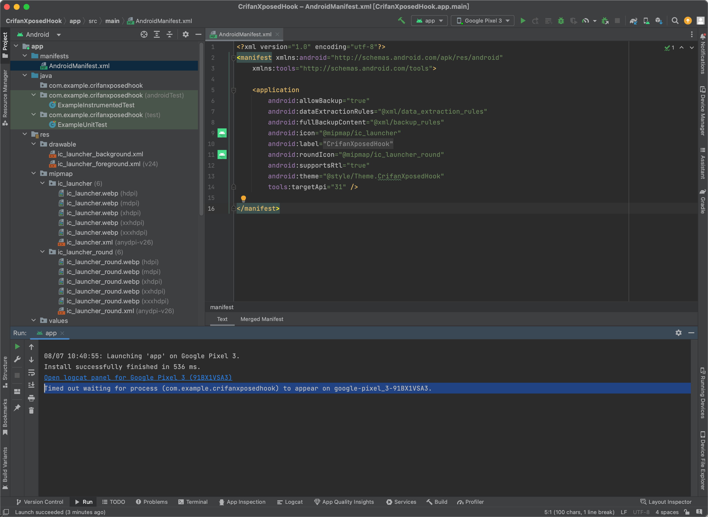
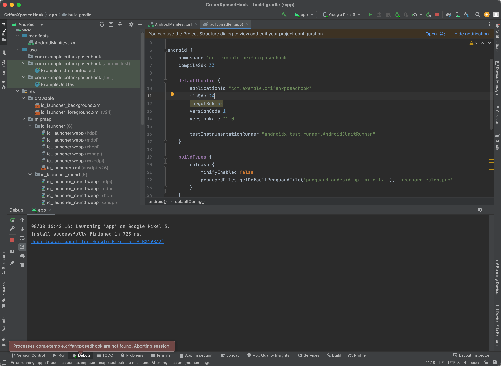

# 改动项目，增加Xposed相关配置

## 新增改动或文件

### 新建xposed_init

新建文件：`app/src/main/assets/xposed_init`

目的：定义插件hook代码所在的类

文件内容：

```c
com.example.crifanxposedhook.XposedHook
```


内容说明：

* `com.example.crifanxposedhook.XposedHook`
  * 是后续的具体的hook插件代码对应的Java的类
    * `com.example.crifanxposedhook`：是包名
    * `XposedHook`：是类名

### 新建hook的Java类文件：XposedHook.java

新建hook代码文件：`app/src/main/java/com/example/crifanxposedhook/XposedHook.java`

目的： 实现hook代码逻辑

文件内容：

```java
package com.example.crifanxposedhook;
import de.robv.android.xposed.IXposedHookLoadPackage;
import de.robv.android.xposed.XposedBridge;
import de.robv.android.xposed.callbacks.XC_LoadPackage.LoadPackageParam;

public class XposedHook implements IXposedHookLoadPackage {
    public void handleLoadPackage(final LoadPackageParam lpparam) throws Throwable {
        XposedBridge.log("XposedHook Loaded app: " + lpparam.packageName);
        // XposedBridge.log("XposedHook Loaded app: packageName=" + lpparam.packageName + ", processName=" + lpparam.processName);
    }
}
```


### 本身已有app名称定义：strings.xml

本身已有：`app/src/main/res/values/strings.xml`

文件内容：

```xml
<resources>
    <string name="app_name">CrifanXposedHook</string>
</resources>
```


* 内容说明
  * 其中`CrifanXposedHook`是当前app名称=Xposed插件名称=安卓项目名称

### 给AndroidManifest.xml中加上xposed相关定义

改动：`app/src/main/AndroidManifest.xml`

目的：新增Xposed相关配置 -> 让EdXposed等Xposed框架可以识别此（安卓的app是）Xposed插件

核心改动：修改`application`的部分属性，并加上`meta-data`的`Xposed`相关属性

改动后的：

文件内容：

```xml
<?xml version="1.0" encoding="utf-8"?>
<manifest xmlns:android="http://schemas.android.com/apk/res/android"
    xmlns:tools="http://schemas.android.com/tools">

    <application
        android:allowBackup="true"
        android:dataExtractionRules="@xml/data_extraction_rules"
        android:fullBackupContent="@xml/backup_rules"
        android:icon="@mipmap/ic_launcher"
        android:label="@string/app_name"
        android:roundIcon="@mipmap/ic_launcher_round"
        android:supportsRtl="true"
        android:theme="@style/Theme.CrifanXposedHook"
        tools:targetApi="31" >

        <!-- 是否是xposed模块，xposed根据这个来判断是否是模块 -->
        <meta-data
            android:name="xposedmodule"
            android:value="true" />

        <!-- 模块描述，显示在xposed模块列表那里第二行 -->
        <meta-data
            android:name="xposeddescription"
            android:value="crifan测试XPosed(LSPosed)插件的hook 20241217" />

        <!-- 最低xposed版本号。对于Xposed来说，最新的是：82
            注：后续如果需要用EdXposed最新的，可以改为：93
         -->
        <meta-data
            android:name="xposedminversion"
            android:value="82" />

    </application>

</manifest>
```


* 参数说明
  * `xposedmodule`=`true`
    * 表示是Xposed插件=Xposed模块
  * `xposeddescription`=`crifan测试XPosed插件hook`
    * 插件描述，会显示=出现在Xposed模块列表中的文字描述部分
   * `xposedminversion`=`82`
    * 表示：`Xposed Framework API`=`Xposed框架的API版本`
      * 此处值：`82`
        * 最新的Xposed框架的API版本就是82
          * 不过其实也是好多年前了（好像是2016年，当前此刻是2023年）
        * 对应支持Android版本：`> Android 5.0`
          * 对于后续要测试的安卓手机的安卓版本（`Android 8.1`，`Android 11`，`Android 13`）等，完全满足此要求
      * 可选值=所有版本：`36`、`37`、`39`、`42`、`50`、`51`、`52`、`53`、`60`、`63`、`65`、`81`、`82`
        * 详见：[IXposedHookLoadPackage | Xposed Framework API](https://api.xposed.info/reference/de/robv/android/xposed/IXposedHookLoadPackage.html)
      * 另外最好：去你的安卓手机中确认当前Xposed的API版本
        * 说明
          * 即使你的Xposed的API版本是更新的版本（`v93.0`、`v100`等），但是：也是兼容旧版本（此处的`v82`的）
        * 比如
          * 此处的Pixel5中，EdXposed首页中的：`v93.0`
            * 
              * 表示用的是，更加新的93的EdXposed的Xposed的API版本
              * 注：更新的API版本，支持其他更新的API接口
                * 但是同时会兼容旧版本Xposed的API接口的
          * 此处安卓12的小米8刷了LineageOS v19.1后的LSPosed中：`API版本`是`100`
            * 
          * 如果是之前旧的`Android 4.4`的安卓手机，则往往Xposed的API版本写的是`54`，测试就要此处设置为
            * `xposedminversion=53`
              * 表示支持 `<= Android 5.0`，因为支持`Android 4.x`的Xposed的API版本是`54`

### 给`app/build.gradle`中加上xposed包的依赖

改动文件：`app/build.gradle`

目的：让Gradle下载相关xposed的jar包（和相关源码）

核心改动：加上：

```bash
        versionName "2024.12.16.1742"

    compileOnly 'de.robv.android.xposed:api:82'
```

变成：

* `app/build.gradle`
  ```json
  plugins {
      id 'com.android.application'
  }

  android {
      namespace 'com.example.crifanxposedhook'
      compileSdk 33

      defaultConfig {
          applicationId "com.example.crifanxposedhook"
          minSdk 24
          targetSdk 33
          versionCode 1
          versionName "2024.12.16.1742"

          testInstrumentationRunner "androidx.test.runner.AndroidJUnitRunner"
      }

      buildTypes {
          release {
              minifyEnabled false
              proguardFiles getDefaultProguardFile('proguard-android-optimize.txt'), 'proguard-rules.pro'
          }
      }
      compileOptions {
          sourceCompatibility JavaVersion.VERSION_1_8
          targetCompatibility JavaVersion.VERSION_1_8
      }
  }

  dependencies {
      implementation 'androidx.appcompat:appcompat:1.6.1'
      implementation 'com.google.android.material:material:1.9.0'
      testImplementation 'junit:junit:4.13.2'
      androidTestImplementation 'androidx.test.ext:junit:1.1.5'
      androidTestImplementation 'androidx.test.espresso:espresso-core:3.5.1'

      compileOnly 'de.robv.android.xposed:api:82'
      // compileOnly 'de.robv.android.xposed:api:82:sources' // 不要导入源码，这会导致idea无法索引文件，从而让语法提示失效
  }
  ```


参数说明：

* xposed相关
  * `compileOnly 'de.robv.android.xposed:api:82'`
    * xposed的jar包依赖，版本是用最新的`82`
      * 和之前的`AndroidManifest.xml`中的`xposedminversion=82`是对应的
  * 注意：
    * 不要添加Xposed的source源码
      * 应该是：`// compileOnly 'de.robv.android.xposed:api:82:sources'`
      * 不要是：`compileOnly 'de.robv.android.xposed:api:82:sources'`
        * 否则后续会导致代码找不到后续的API接口的类
          * 具体详见：[常见问题](../../dev_xposed_plugin/add_xposed_config/common_issues.md)
  * 注：
    * [xposed官网](https://github.com/rovo89/XposedBridge/wiki/Using-the-Xposed-Framework-API)推荐的`provided`（而不要用`compile`）已废弃，所以改用推荐的：`compileOnly`
      * `compileOnly`：表示代码编译会调用到，但是编译后输出的apk不会包含XPosed的库
        * 这样就不会导致报错：`java.lang.IllegalAccessError Class ref in pre-verified class resolved to unexpected implementation`
* app相关
  * `versionName "2024.12.16.1742"`
    * app的版本号
      * 在app列表详情页和EdXposed的Xposed插件列表中可以看到

### 给项目全局根目录的Gradle配置文件`settings.gradle`加上Xposed的源地址

项目级别的=全局的Gradle配置文件：`settings.gradle`

目的：加入xposed包所在的源的依赖

改动：

给`dependencyResolutionManagement`的`repositories`加上Xposed的源：

`maven { url 'https://maven.aliyun.com/repository/public/' }`

或

`maven { url 'https://api.xposed.info/' }`

变成：

* `settings.gradle`
  ```json
  pluginManagement {
      repositories {
          google()
          mavenCentral()
          gradlePluginPortal()
      }
  }
  dependencyResolutionManagement {
      repositoriesMode.set(RepositoriesMode.FAIL_ON_PROJECT_REPOS)
      repositories {
          google()
          mavenCentral()
          // jcenter()
          maven { url 'https://maven.aliyun.com/repository/public/' }
      }
  }
  rootProject.name = "CrifanXposedHook"
  include ':app'
  ```


参数说明：

* xposed的源
  * 最新的=可用的
    * `https://maven.aliyun.com/repository/public/`
    * `https://api.xposed.info/`
  * 之前的=已废弃=不可用的
    * `jcenter()`
      * 注：jcenter的源，早已废弃
        * 对应的，之前可用，现在早已失效的地址
          * https://jcenter.bintray.com/de/robv/android/xposed/api/82/api-82-sources.jar
          * https://jcenter.bintray.com/de/robv/android/xposed/api/82/api-82.jar
        * 分别对应着（之前的）配置
          * `compileOnly 'de.robv.android.xposed:api:82'`
          * `compileOnly 'de.robv.android.xposed:api:82:sources'`

## 调试参数设置

### Launch改为Nothing

此处，由于：

* 新建项目时，就选择了`No Activity`
* 且此处项目中的确也没有Activity

所以需要去：

把项目调试配置中的：

`Android Studio`->`Run`->`Edit Configuration`->`Android App`->`app`->`General`->`Launch Options`->从默认的：

* `Launch`: `Default Activity`
  * 

改为：

* `Launch`: `Nothing`
  * 

说明：

* 如果不改，则默认去Debug调试，会去尝试启动Default Activity，但是由于此处没有Activity=页面，导致报错
  ```bash
  Could not identify launch activity: Default Activity not found
  Error while Launching activity
  Failed to launch an application on all devices
  ```
  * 
* 改了后，后续点击Debug调试按钮去调试时
  * 最后会报错
    * 要么是：`Timed out waiting for process xxx to appear on`
      * 
    * 要么是：`Processes xxx are not found Aborting session`
      * 
  * 原因：感觉是，安卓中，Activity=页面=Process=进程
    * 而当前Xposed插件的项目中，的确没有Activity，所以没有进程可供调试，所以报错

## 其他

### 无需关闭Instant Run

此处Android Studio的版本是`Android Studio Flamingo | 2022.2.1 Patch 2`，此处：

* 已经没有[官网提示的Instant Run](https://github.com/rovo89/XposedBridge/wiki/Using-the-Xposed-Framework-API)了
  * 最多算是有个，或许相关的，但是默认没有开启的
    * `Live Edit`
      * 
* 所以无需去：关闭`Instant Run`。
