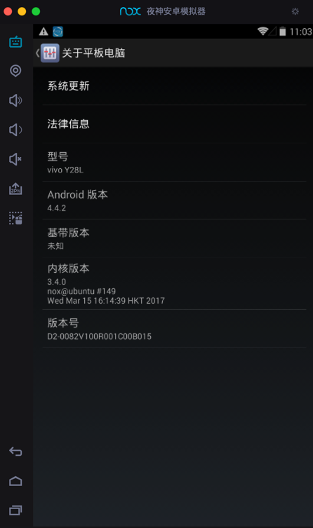

# 附录

## 旧版本的相关配置

之前旧版本：

* `Android 4.4` + `xposed v53` + `Android Studio v4.2.2`

的相关内容：

### `app/src/main/AndroidManifest.xml`

另外贴出，之前，针对于旧版本`Android 4.4`的安卓手机

* 当时是`Android 4.4.2`的`Nox夜神模拟器`
  * 
  * 对应adb连接并查看设备
    ```bash
    crifan@licrifandeMacBook-Pro  ~  adb connect 127.0.0.1:62001
    connected to 127.0.0.1:62001
    crifan@licrifandeMacBook-Pro  ~  adb devices
    List of devices attached
    127.0.0.1:62001    device
    ```

的`src/main/AndroidManifest.xml`的配置：

```xml
<manifest xmlns:android="http://schemas.android.com/apk/res/android"
    xmlns:tools="http://schemas.android.com/tools"
    package="com.crifan.crifanxposedmodule">

    <!--android:debuggable="true"-->
    <!--tools:ignore="HardcodedDebugMode"-->
    <!--android:exported="true"-->

    <application
        android:allowBackup="true"
        android:icon="@mipmap/ic_launcher"
        android:label="@string/app_name"
        android:roundIcon="@mipmap/ic_launcher_round"
        android:supportsRtl="true"
        android:theme="@style/AppTheme"
    >
        <!-- 是否是xposed模块，xposed根据这个来判断是否是模块 -->
        <meta-data
            android:name="xposedmodule"
            android:value="true" />

        <!-- 模块描述，显示在xposed模块列表那里第二行 -->
        <meta-data
            android:name="xposeddescription"
            android:value="crifan测试XPosed模块开发" />

        <!-- 最低xposed版本号。用最新的：82
            详见：
                https://github.com/rovo89/XposedBridge/wiki/Using-the-Xposed-Framework-API
                https://github.com/rovo89/XposedBridge/wiki/Development-tutorial
                https://raw.githubusercontent.com/rovo89/XposedBridge/art/app/doclib/api/changelog.txt
            但会报错：该模块需要较新版本的XposedBridge（82），因此无法激活
            所以还是改为 53
         -->
        <meta-data
            android:name="xposedminversion"
            android:value="53" />

    </application>
</manifest>
```

供参考。

### `app/build.gradle`

对于之前的旧版本的`Android Studio v4.2.2` 来说：

app的Gradle配置：`app/build.gradle`

主要是加了：`compileOnly 'de.robv.android.xposed:api:53'`

内容为：

```json
apply plugin: 'com.android.application'

android {
    compileSdkVersion 29
    defaultConfig {
        applicationId "com.crifan.crifanxposedmodule"
        minSdkVersion 19
        targetSdkVersion 29
        versionCode 3
        versionName "1.2"
        testInstrumentationRunner "android.support.test.runner.AndroidJUnitRunner"
    }
    buildTypes {
        release {
            minifyEnabled false
            proguardFiles getDefaultProguardFile('proguard-android-optimize.txt'), 'proguard-rules.pro'
        }
    }
}

dependencies {
    implementation fileTree(dir: 'libs', include: ['*.jar'])
    implementation 'com.android.support:appcompat-v7:28.0.0'
    testImplementation 'junit:junit:4.12'
    androidTestImplementation 'com.android.support.test:runner:1.0.2'
    androidTestImplementation 'com.android.support.test.espresso:espresso-core:3.0.2'

    compileOnly 'de.robv.android.xposed:api:53'
}
```

### `build.gradle`

对于之前的旧版本的`Android Studio v4.2.2` 来说：

系统全局的：`build.gradle`配置：

核心改动：`buildscript`和`allprojects`中的`repositories`中，都加上了：xposed的源

内容为：

```json
// Top-level build file where you can add configuration options common to all sub-projects/modules.

buildscript {
    repositories {
        google()
        jcenter()
    }
    dependencies {
        classpath 'com.android.tools.build:gradle:7.0.0'
        
        // NOTE: Do not place your application dependencies here; they belong
        // in the individual module build.gradle files
    }
}

allprojects {
    repositories {
        google()
        jcenter()
    }
}

task clean(type: Delete) {
    delete rootProject.buildDir
}
```
