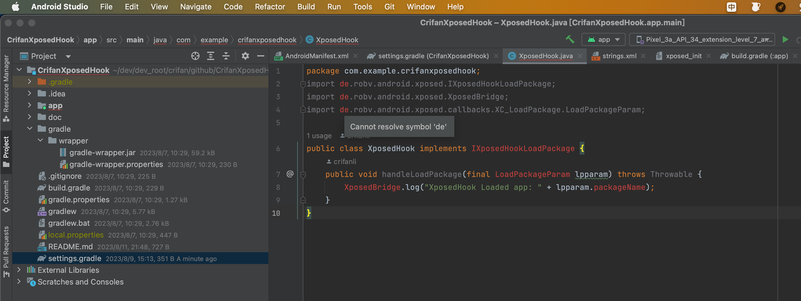
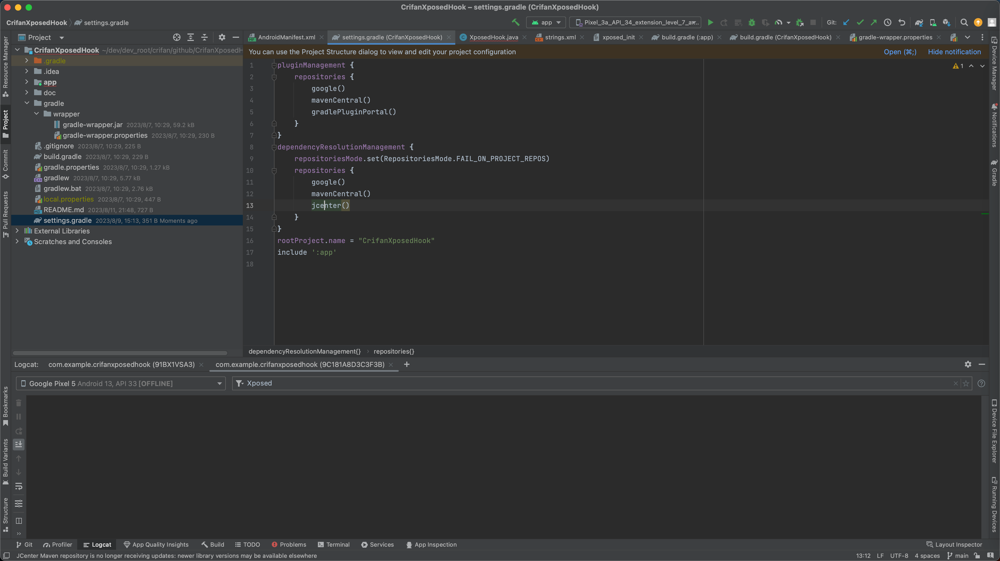
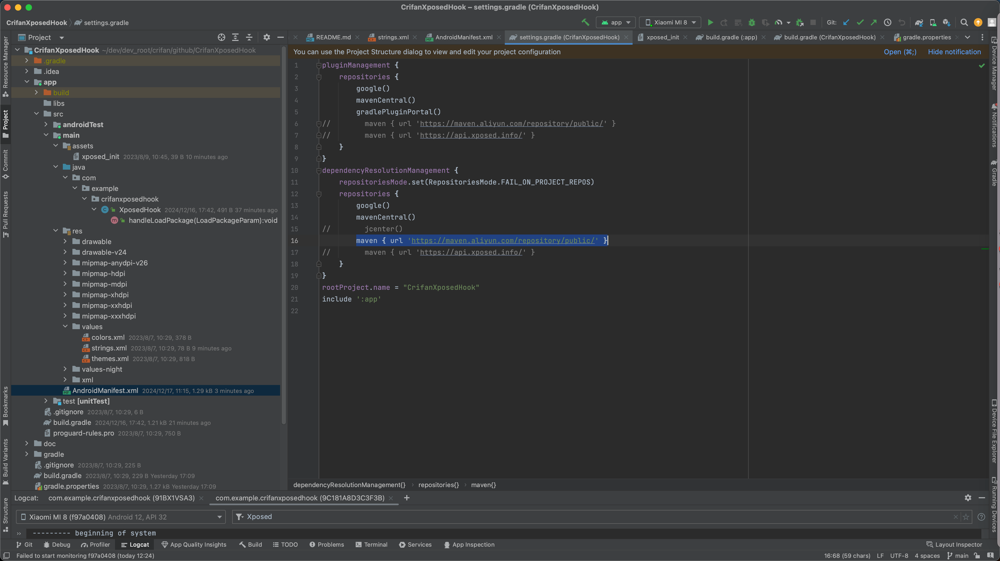
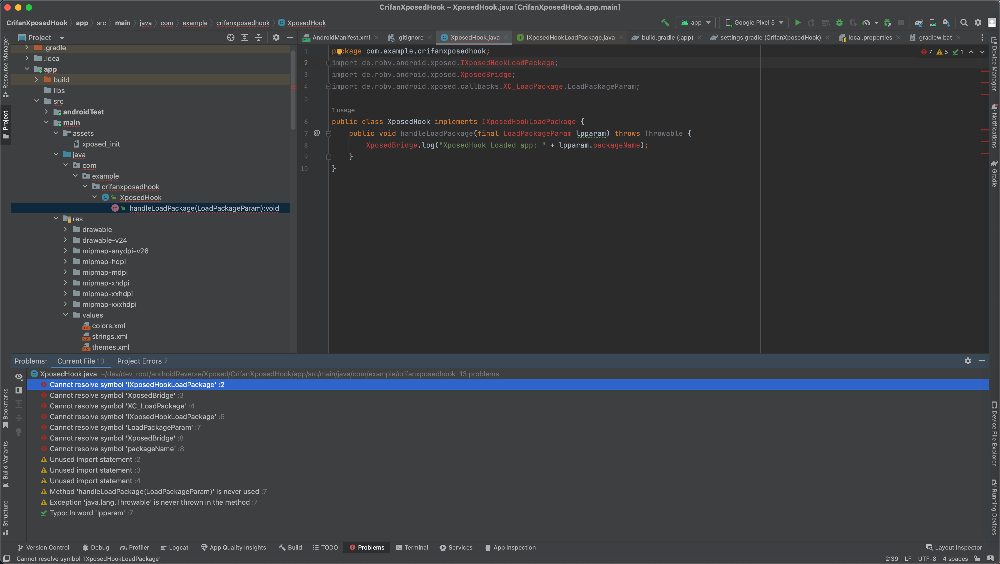
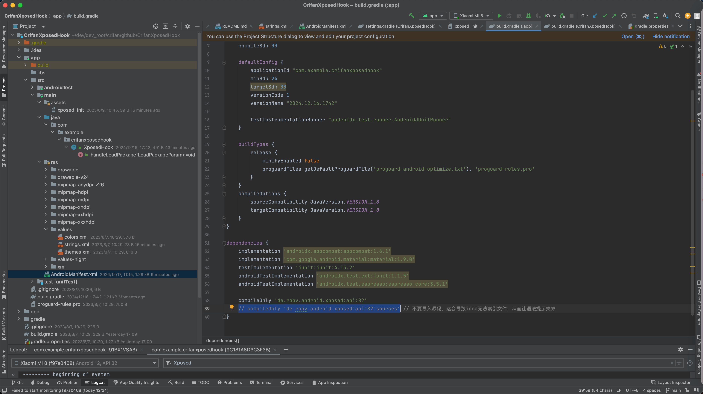

# 常见问题

## Cannot resolve symbol 'de'

* 现象

```java
import de.robv.android.xposed.IXposedHookLoadPackage;
import de.robv.android.xposed.XposedBridge;
import de.robv.android.xposed.callbacks.XC_LoadPackage.LoadPackageParam;
```

中的，找不到导入的Xposed的包，从最开始的`de`就无法识别：

```bash
Cannot resolve symbol 'de'
```



* 原因和解决办法
  * 之前=早期
    * 原因：没有加入Xposed的源
    * 解决办法：加上`jcenter`的源
    * 具体步骤：给`settings.gradle`中的`dependencyResolutionManagement`的`repositories` 加上：`jcenter()`
      * 
  * 最新=现在：20241217
    * 原因：jcenter源已废弃
    * 解决办法：换个其他的有效的Xposed的源
      * 其他可用的Xposed的源
        * https://maven.aliyun.com/repository/public/
        * https://api.xposed.info/
    * 具体步骤：
      * 给`settings.gradle`中的`dependencyResolutionManagement`的`repositories` 加上：
        * 阿里云的
          ```bash
          maven { url 'https://maven.aliyun.com/repository/public/' }
          ```
            * 
        * 或 xposed的
          ```bash
          maven { url 'https://api.xposed.info/' }
          ```

## Cannot resolve symbol IXposedHookLoadPackage

* 现象

已经加上了有效的Xposed的源，也能识别Xposed的包和类了，但是代码：

```java
import de.robv.android.xposed.IXposedHookLoadPackage;
```

还会报错：

```bash
Cannot resolve symbol 'IXposedHookLoadPackage'
Cannot resolve symbol 'LoadPackageParam'
Cannot resolve symbol 'XposedBridge'

Cannot resolve symbol 'packageName'
```



* 原因
  * 此处额外加上了Xposed的源码，导致AS中无法（正常的）识别Xposed的类
* 解决办法
  * 去掉Xposed的source
* 具体做法
  * 去掉 = 注释掉 `app/build.gradle`中的
    * `compileOnly 'de.robv.android.xposed:api:82:sources'`
  * 变成
    * `// compileOnly 'de.robv.android.xposed:api:82:sources' // 不要导入源码，这会导致idea无法索引文件，从而让语法提示失效`
      * 
