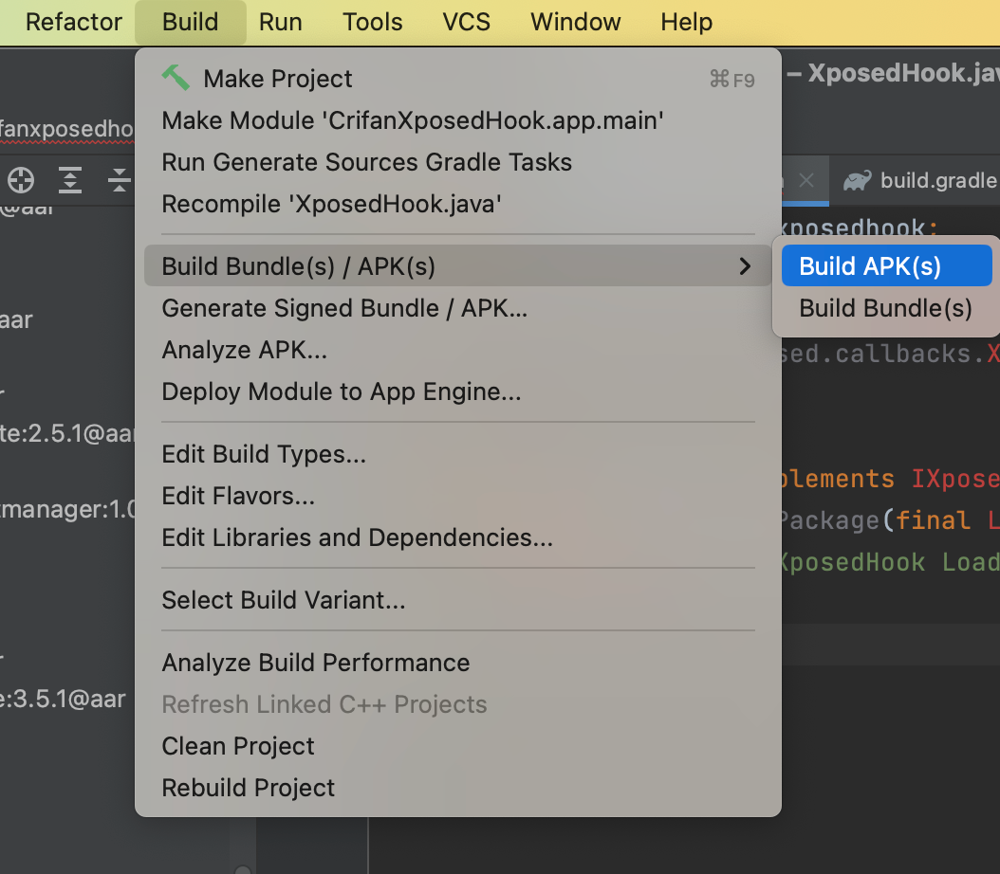
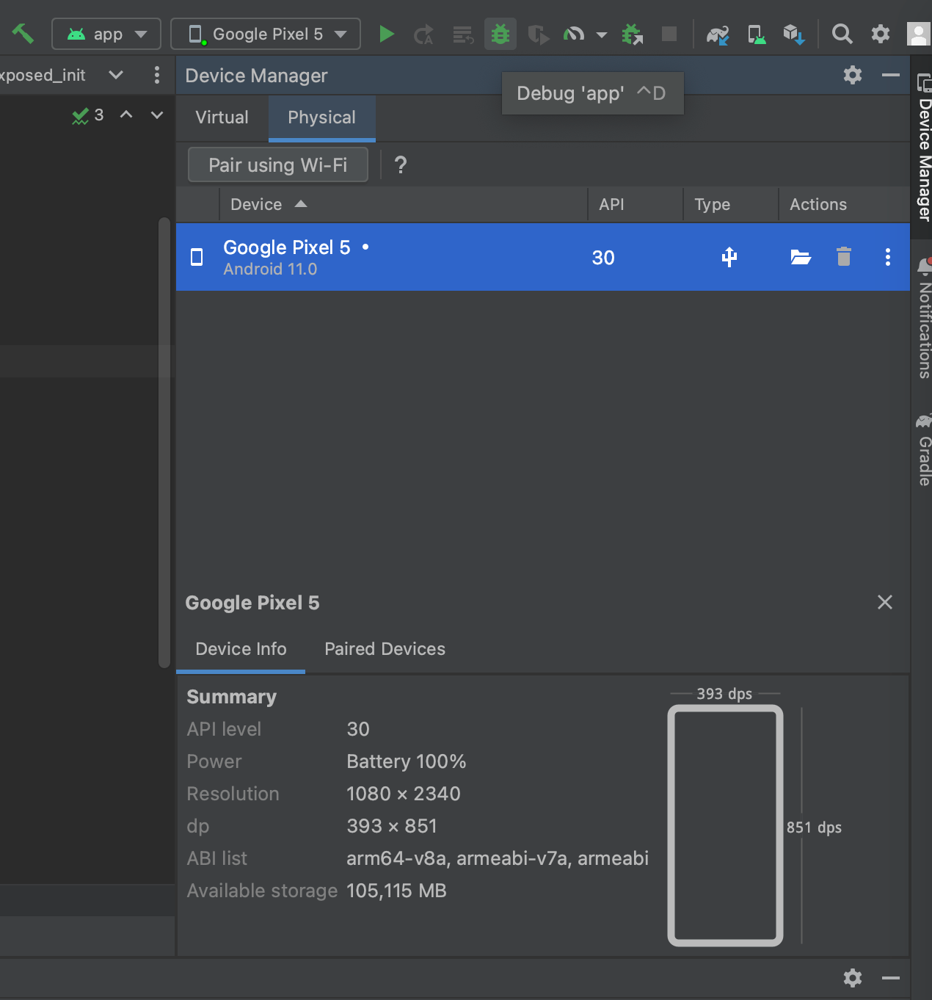

# 编译安装Xposed插件apk

接着再去

* 手动编译生成apk
  * 编译项目=编译出Xposed插件的安卓apk = Build apk
    * `Android Studio`->`Build`->`Build Bundle(s)/APK(s)`->`Build APK(s)`
      * 
    * 即可编译出Xposed插件=类似于普通安卓app的apk文件
  * 再手动下载到安卓手机中，手动去安装apk
* 或者直接自动的：编译+安装apk
  * 点击`Android Studio`中的`Debug app`（或运行`Run`）按钮
    * 
  * 即可自动完成
    * 编译出apk
    * 安装apk到安卓手机
    * 尝试调试（或运行）
      * 注：此处实际上由于没有Activity，所以调试（或运行）会报错：
        * 找不到进程
          * `Processes are not found Aborting session` 或 `Timed out waiting for process to appear on`
        * 不过此处已实现我们的目标：安装最新版Xposed插件的apk到安卓手机了
          * 剩下的，则忽略这些错误即可
