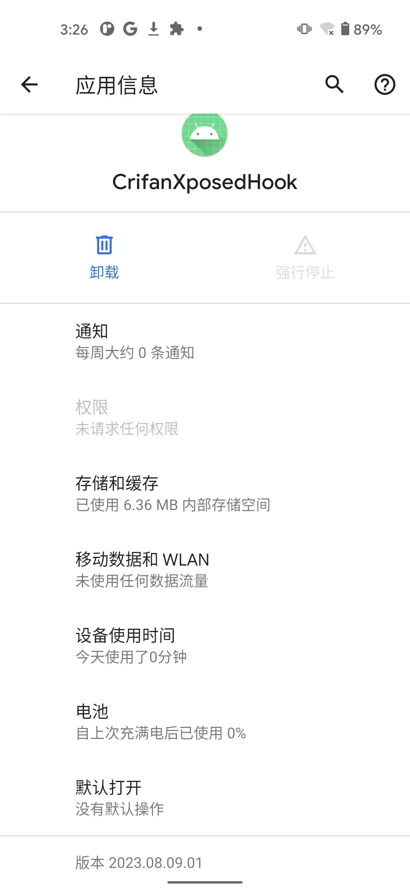
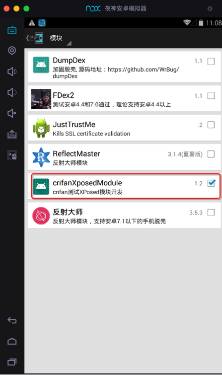
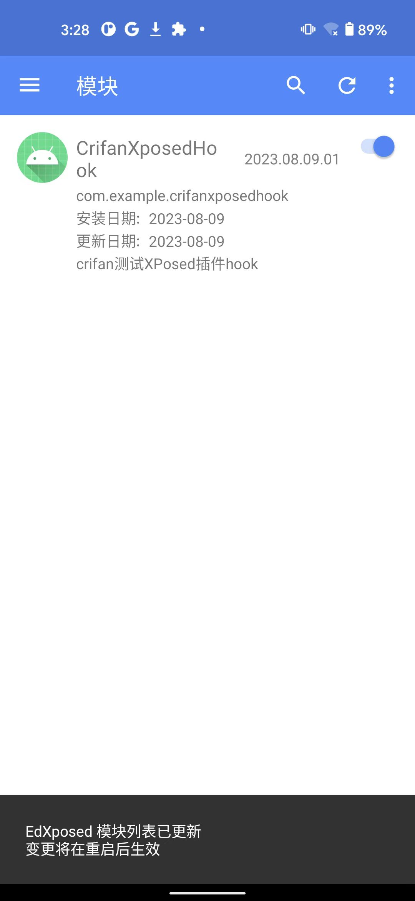
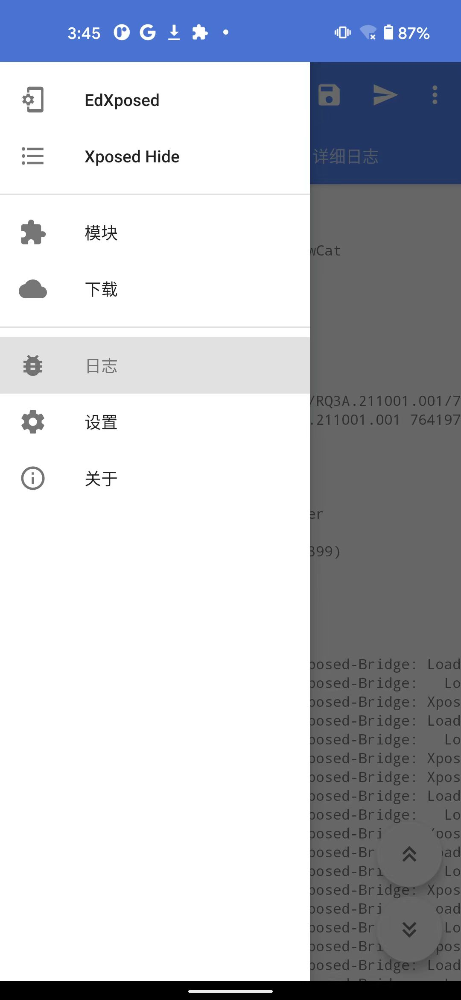
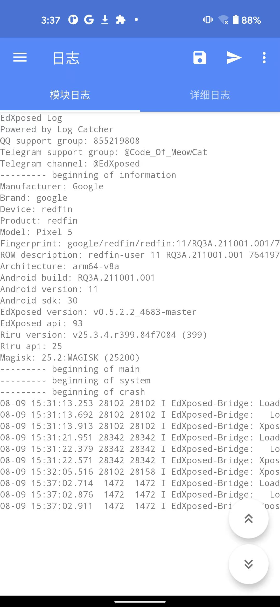
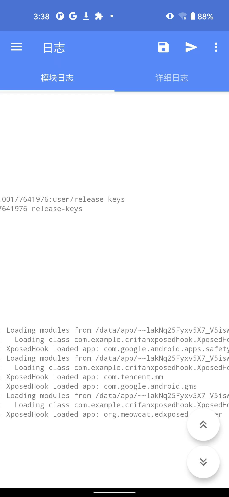
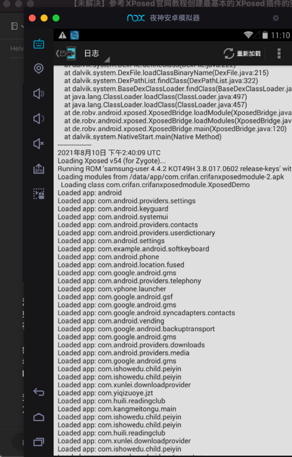
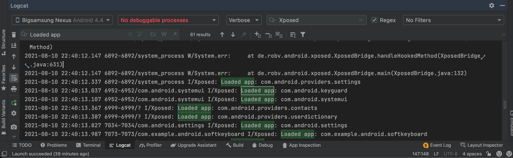

# 确认插件已安装和能生效

此时，`Xposed插件`=`普通的安卓apk`，已安装到安卓手机中：

## 如何确认Xposed插件已安装成功

可以通过，去下面这些地方：

* 安卓手机中设置中系统的应用列表中
  * 
* Xposed框架中模块列表中
  * 此处EdXposed
    * 
  * 对比：旧的`Xposed Installer`中的Xposed模块列表中，显示效果是这种
    * 

能看到：自己的Xposed插件=普通安卓app，则说明：Xposed插件已成功安装

## 如何确认Xposed插件正常工作已生效

### 先开启插件

此处EdXposed中看到的自己的Xposed插件，右边有个开关，点击开启：

* 

注：开启插件时，底部会出现提示：`EdXposed模块列表已更新，变更将在重启后生效`

（根据提示，继续）再去重启EdXposed

* 对比：旧的`Xposed Installer`中，新安装了Xposed插件后，需要重启Android手机才能使得插件生效

即可成功开启插件。

### 再确认插件是否正常工作

如何确认=测试Xposed插件已生效=真正正常工作了?

先去安卓手机Pixel5中操作：随便打开任意一些普通的安卓app即可

然后去找找，能看到输出对应hook的log日志，就说明插件正常生效了

问题变成：如何查看Xposed插件的hook的log日志

目前已知主要有2种方式：

* Xposed框架中的日志
* Android Studio中的LogCat

#### Xposed框架中的日志

对于此处的：EdXposed

`EdXposed`->`日志`->`模块日志`：



就可以看到hook的log日志：





其中的：

* XposedHook Loaded app: com.google.android.apps.safetyhub
* XposedHook Loaded app: com.tencent.mm
* XposedHook Loaded app: com.google.android.gms
* XposedHook Loaded app: org.meowcat.edxposed.manager

就表示，我们之前的Xposed的hook代码

```java
XposedBridge.log("XposedHook Loaded app: " + lpparam.packageName);
```

真正工作了：能hook到对应的app了，输出对应的log了。

* 导出全部日志

另外，点击右上角纸飞机的按钮，可以导出当前全部的`.txt`日志文件：

* `EdXposed_Modules_20230809_153813.txt`
  ```txt
  EdXposed Log
  Powered by Log Catcher
  QQ support group: 855219808
  Telegram support group: @Code_Of_MeowCat
  Telegram channel: @EdXposed
  --------- beginning of information
  Manufacturer: Google
  Brand: google
  Device: redfin
  Product: redfin
  Model: Pixel 5
  Fingerprint: google/redfin/redfin:11/RQ3A.211001.001/7641976:user/release-keys
  ROM description: redfin-user 11 RQ3A.211001.001 7641976 release-keys
  Architecture: arm64-v8a
  Android build: RQ3A.211001.001
  Android version: 11
  Android sdk: 30
  EdXposed version: v0.5.2.2_4683-master
  EdXposed api: 93
  Riru version: v25.3.4.r399.84f7084 (399)
  Riru api: 25
  Magisk: 25.2:MAGISK (25200)
  --------- beginning of main
  --------- beginning of system
  --------- beginning of crash
  08-09 15:31:13.253 28102 28102 I EdXposed-Bridge: Loading modules from /data/app/~~lakNq25Fyxv5X7_V5iswfQ==/com.example.crifanxposedhook-nubXoNVT2XbwkrSmpZB8tQ==/base.apk
  08-09 15:31:13.692 28102 28102 I EdXposed-Bridge:   Loading class com.example.crifanxposedhook.XposedHook
  08-09 15:31:13.913 28102 28102 I EdXposed-Bridge: XposedHook Loaded app: com.google.android.apps.safetyhub
  08-09 15:31:21.951 28342 28342 I EdXposed-Bridge: Loading modules from /data/app/~~lakNq25Fyxv5X7_V5iswfQ==/com.example.crifanxposedhook-nubXoNVT2XbwkrSmpZB8tQ==/base.apk
  08-09 15:31:22.379 28342 28342 I EdXposed-Bridge:   Loading class com.example.crifanxposedhook.XposedHook
  08-09 15:31:22.571 28342 28342 I EdXposed-Bridge: XposedHook Loaded app: com.tencent.mm
  08-09 15:32:05.516 28102 28158 I EdXposed-Bridge: XposedHook Loaded app: com.google.android.gms
  08-09 15:37:02.714  1472  1472 I EdXposed-Bridge: Loading modules from /data/app/~~lakNq25Fyxv5X7_V5iswfQ==/com.example.crifanxposedhook-nubXoNVT2XbwkrSmpZB8tQ==/base.apk
  08-09 15:37:02.876  1472  1472 I EdXposed-Bridge:   Loading class com.example.crifanxposedhook.XposedHook
  08-09 15:37:02.911  1472  1472 I EdXposed-Bridge: XposedHook Loaded app: org.meowcat.edxposed.manager
  ```

对比：旧版Xposed：`XPosed Installer`中，看到的Xposed插件的hook的log日志是：



#### Android Studio中的LogCat

（之前旧版）`AS`->`LogCat`->`filter`：`XPosed`，可以查看到hook日志：


