# 用AndroidStudio创建基本的安卓app项目

先用`Android Studio`去创建一个最基本的，普通的安卓app的项目：

* 核心步骤：`Android Studio`->`New Project`->`No Activity`->设置项目基本属性：`Name`、`Package Name`、`Save Location`、`Language`、`Minimum SDK` ->`Finish`

详细步骤：

## 新建项目

点击：`New Project`

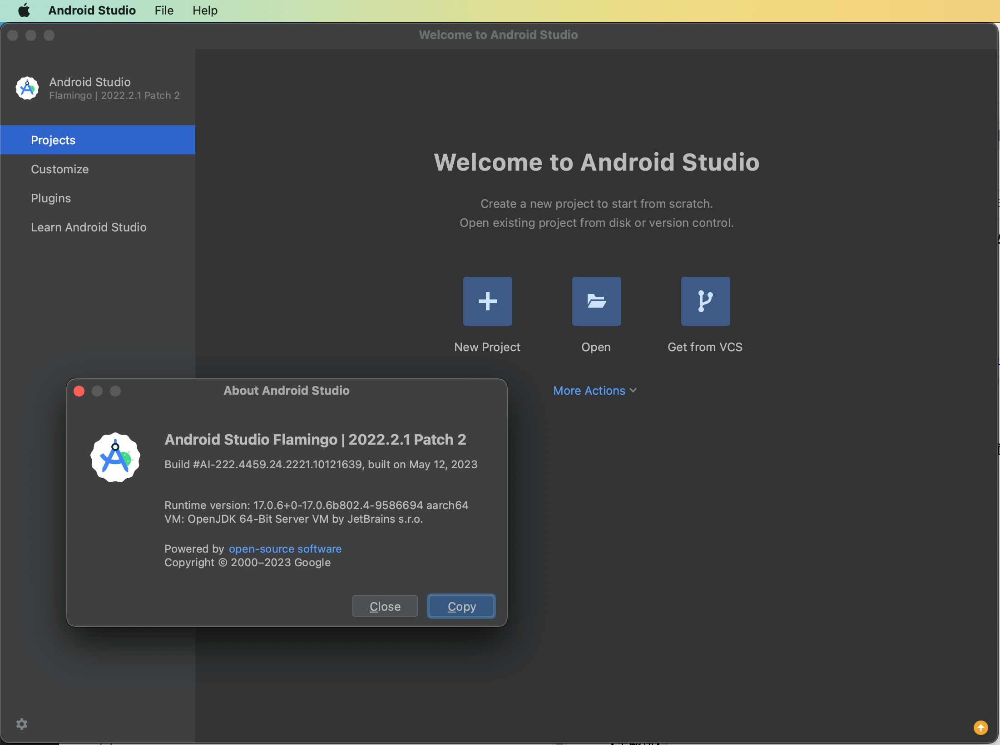

## 选择类型：No Activity

此处选择：`No Activity`=无页面

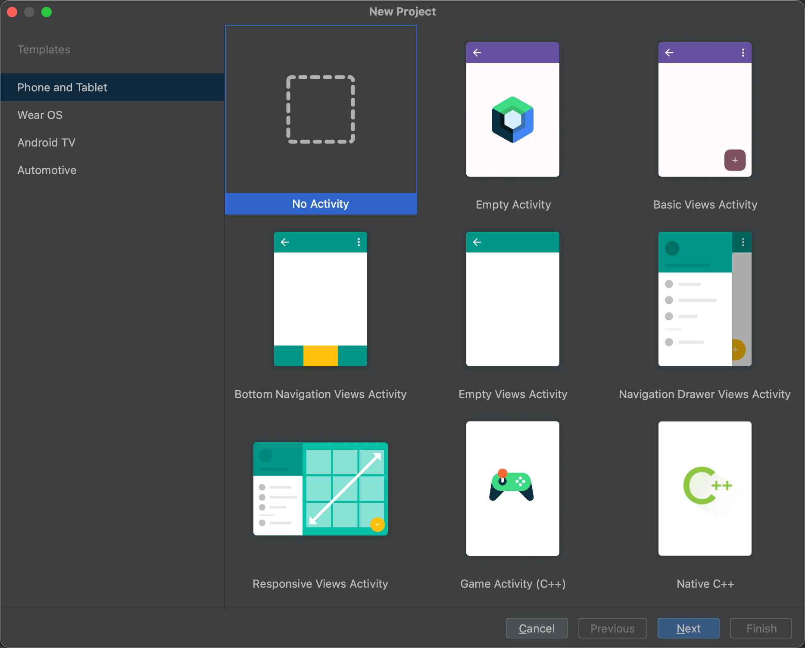

* 说明
  * 因为此处最基本的Xposed插件，无需页面
    * 只要触发了对应的hook代码，能输出log，就表示真正生效了
  * 另外：复杂的Xposed插件，可以根据自己需要去加上页面
    * 用以支持各种配置和逻辑等等更多其他内容

## 设置项目基本参数

继续去设置安卓项目的基本参数：

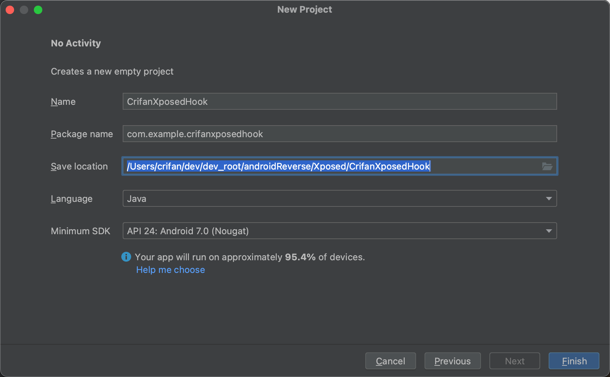

* Name：`CrifanXposedHook`
* Package Name：`com.example.crifanxposedhook`
* Save Location：`/Users/crifan/dev/dev_root/androidReverse/Xposed/CrifanXposedHook`
* Language：`Java`
  * 为了保险起见，先选`Java`，等熟悉了，再换到`Kotlin`
* Minimum SDK：`API 24: Android 7.0 (Nougat)`
  * 其他选项
    * 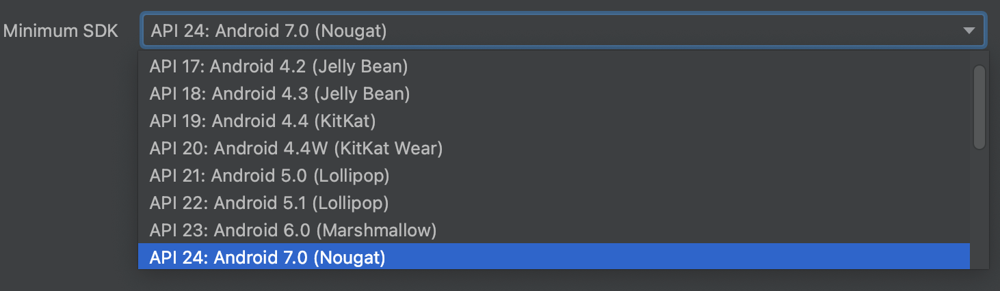
    * 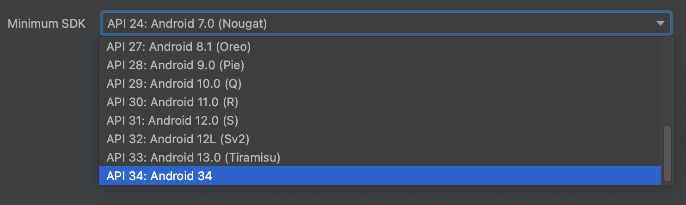
  * 可以根据自己需要，改为其他版本，比如更高版本的：`API 27: Android 8.1 (Oreo)`

## 初始化项目

点击`Finish`后，即可开始项目初始化，下载相关SDK等内容，直到下载完成：

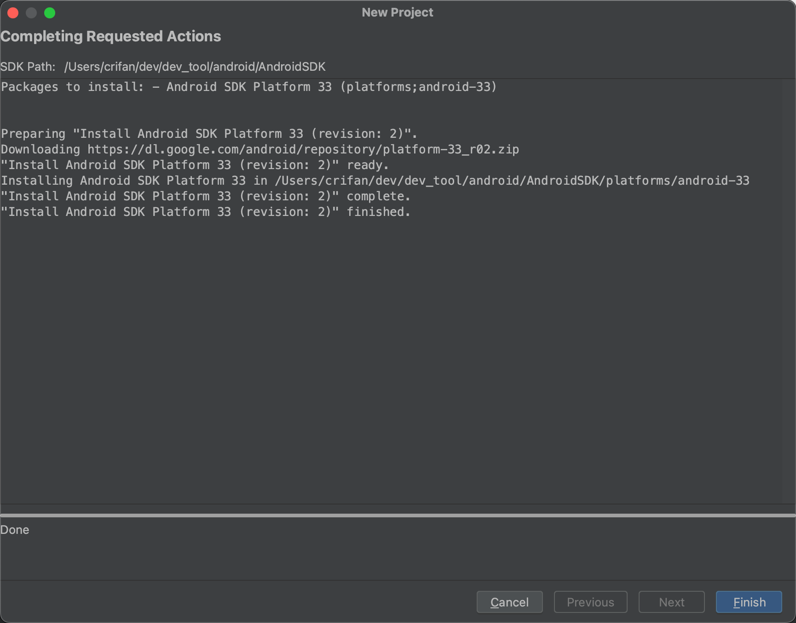

进入Android Studio的主页面，开始项目初始化：

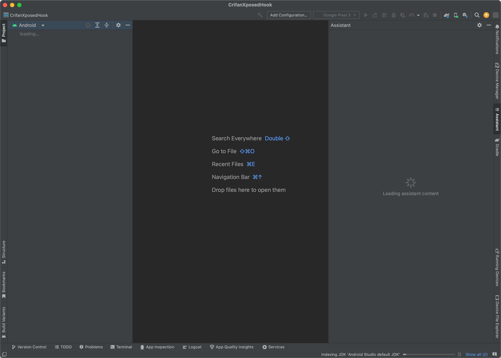

后续会继续初始化，包括Gradle等相关资源的下载、导入、重建索引等。

最后初始化完毕：

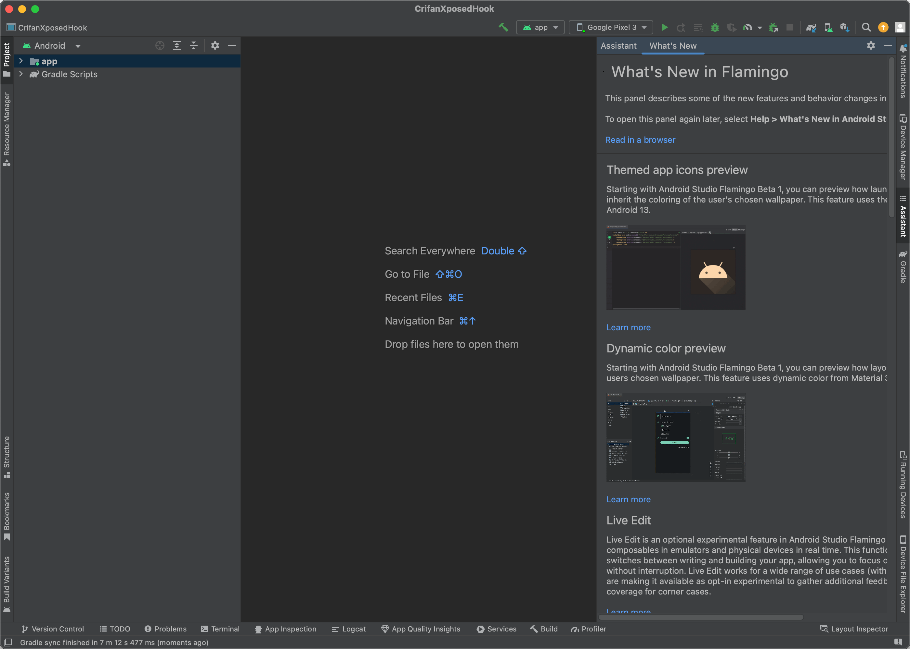

### 设置代理

* 由于，从google等国外网站下载Google开发相关的资源，比如SDK等，国内网络经常无法连接或下载速度慢，所以此处往往还会弹框，问你是否要加代理
  * 此处选择添加代理，使用此处Mac中已有的Trojan的代理：
    ```bash
    export HTTP_PROXY=http://127.0.0.1:58591; export HTTPS_PROXY=http://127.0.0.1:58591; export ALL_PROXY=socks5://127.0.0.1:51837
    ```
  * 对应代理设置是：
    * 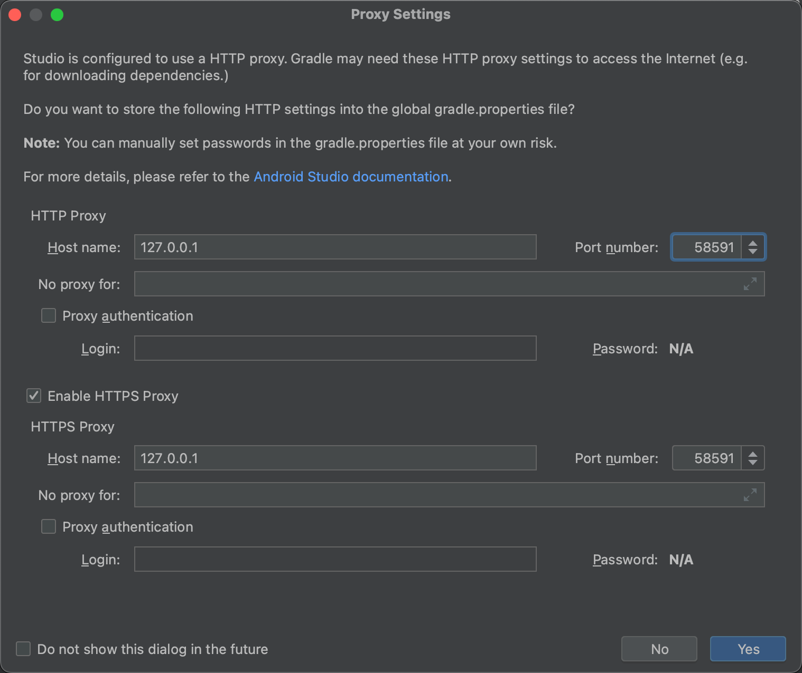
  * AS项目设置后的全局配置是
    * 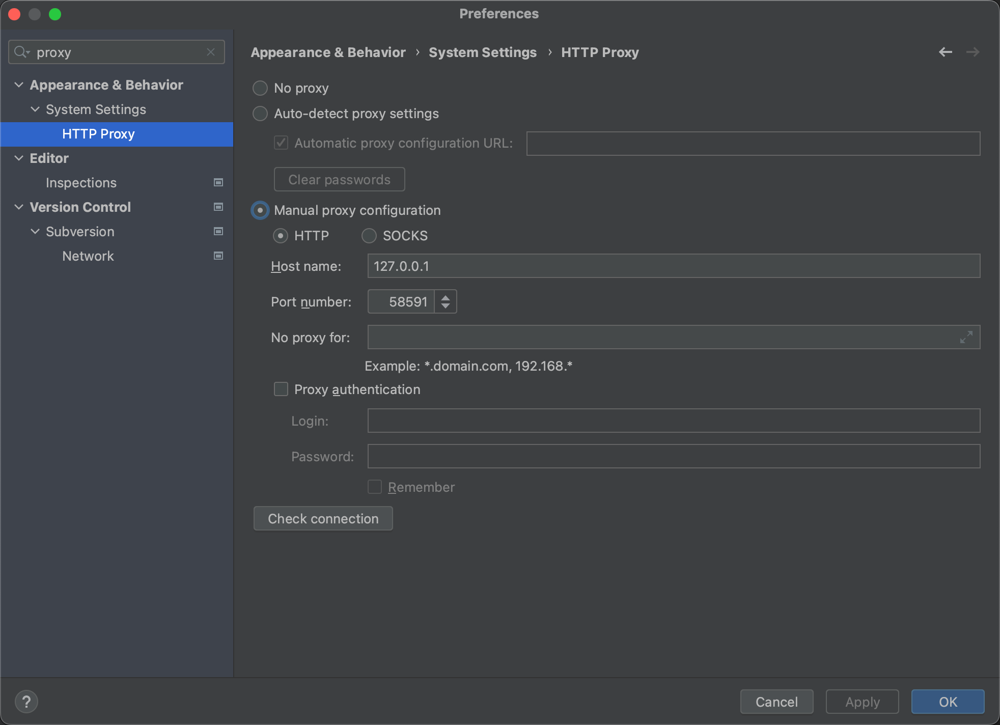

## 最终项目文件和结构

点击展开目录结构如下：

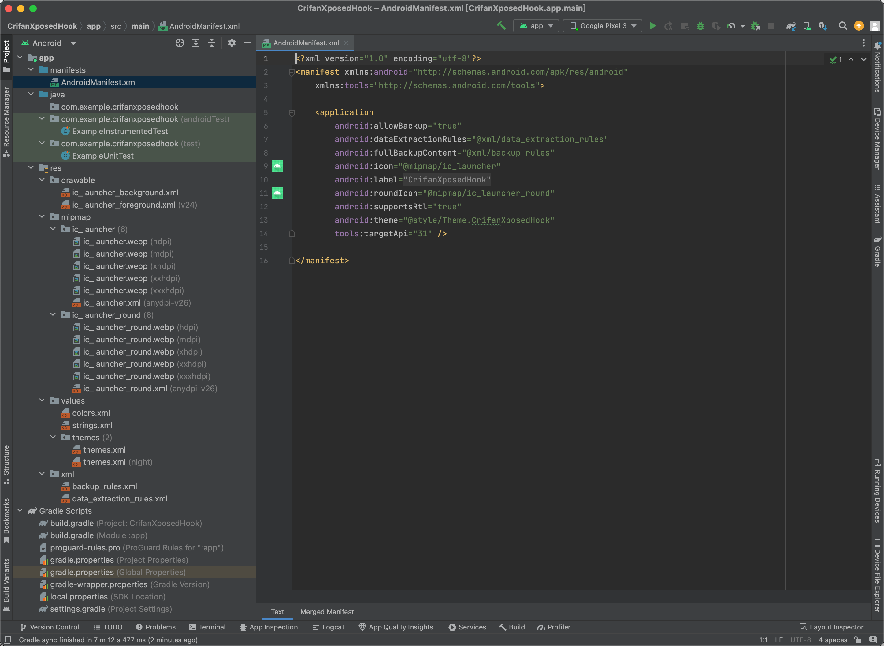
