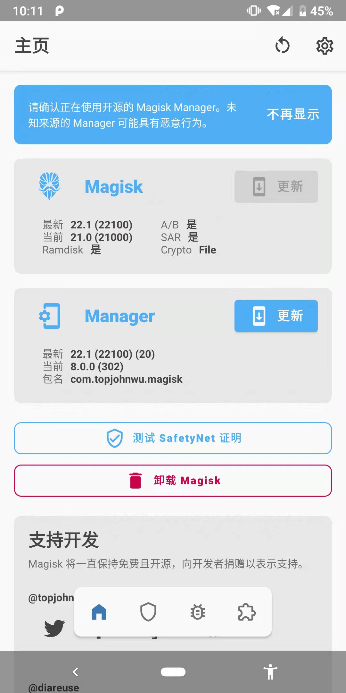
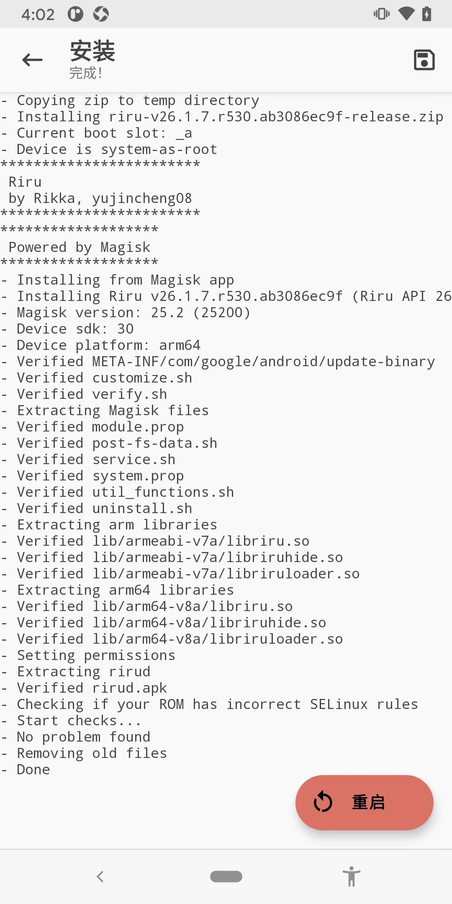
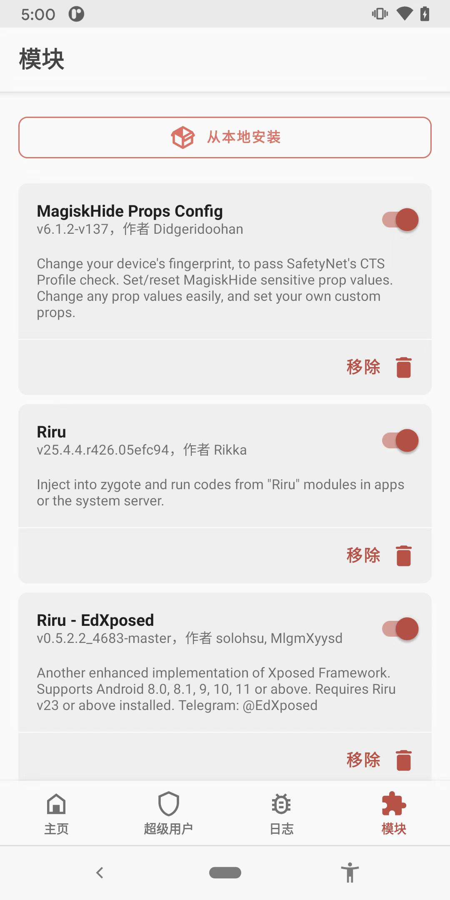
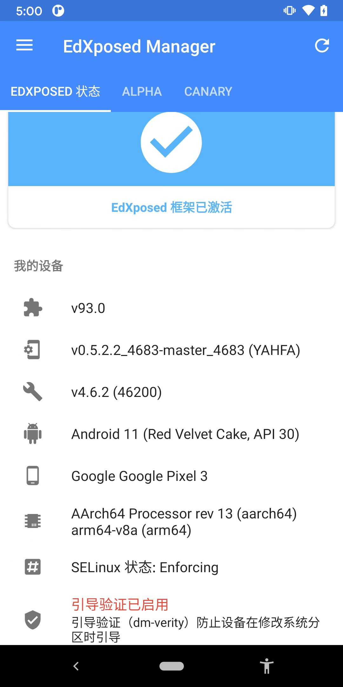

# 安装EdXposed

此处介绍`Android 11`的`Google Pixel 3`中如何安装`EdXposed`：

要安装`EdXposed框架`的话，要：

* 先安装好：`Magisk`
  * 
* 再安装2部分
  * `Magisk`的插件
    * 先：`Riru` = `Riru Core`
    * 再：`EdXposed`
      * 依赖于：`Riru插件`
      * 是：`EdXposed`的`Core`端
  * `EdXposed Manager`=`EdXposed的app端`

或者换种说法：

* `EdXposed`分2部分
  * `EdXposed`的**core**内核
    * Magisk中的：`EdXposed插件` = `Riru-EdXposed`
      * 其依赖于：Magisk插件：`Riru`
  * `EdXposed`的**app**端
    * `EdXposed Manager`的apk

所以分别去下载和安装：

* `EdXposed Manager`
  * [Releases · ElderDrivers/EdXposedManager (github.com)](https://github.com/ElderDrivers/EdXposedManager/releases)
    * https://github.com/ElderDrivers/EdXposedManager/releases/download/v4.6.2.0.0/EdXposedManager-4.6.2-46200-org.meowcat.edxposed.manager-release.apk
* `Magisk插件`
  * `Riru (Core)`
    * [Releases · RikkaApps/Riru (github.com)](https://github.com/RikkaApps/Riru/releases)
      * https://github.com/RikkaApps/Riru/releases/download/v25.4.4/riru-v25.4.4-debug.zip
  * `EdXposed`
    * [Releases · ElderDrivers/EdXposed (github.com)](https://github.com/ElderDrivers/EdXposed/releases)
      * https://github.com/ElderDrivers/EdXposed/releases/download/v0.5.2.2/EdXposed-v0.5.2.2_4683-master-z-debug.zip

安装过程：

* Magisk的插件
  * `Riru插件` = `Riru` = `Riru Core`
    * 
* `EdXposed Manager`
  ```bash
  adb install EdXposedManager-4.6.2-46200-org.meowcat.edxposed.manager-release.apk
  ```

安装后效果：

* `Magisk`：新增`Riru`和`Riru - EdXposed`插件
  * 
* `EdXposed Manager`：用于管理EdXposed框架
  * 
