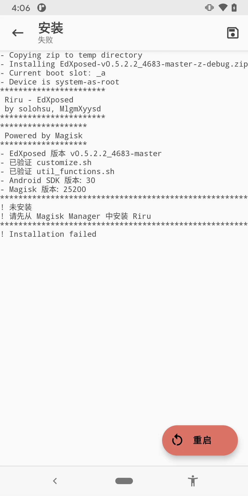
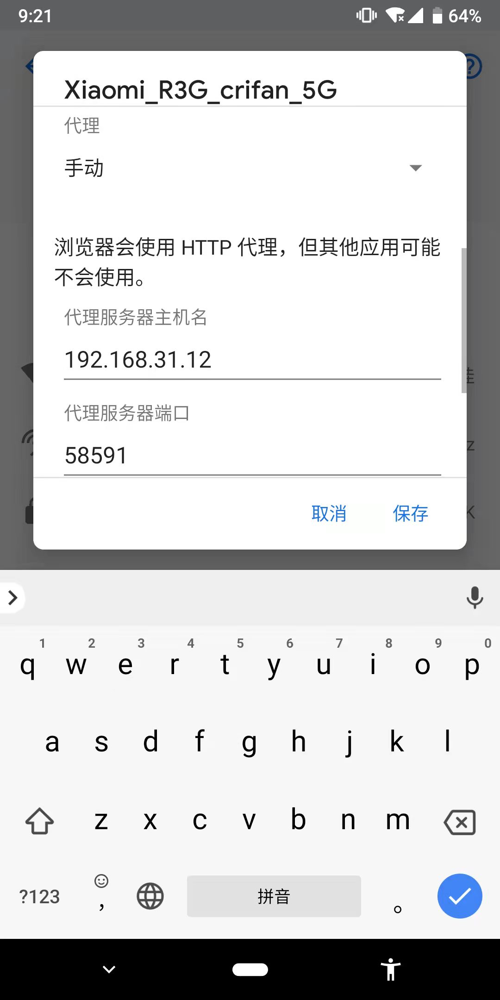
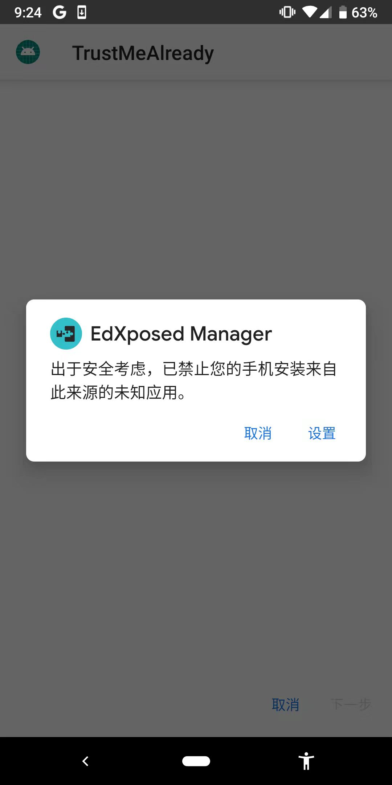

# EdXposed常见问题

## 请先从 Magisk Manager中安装Riru，Installation failed

* 现象：`Android 11`的`Google Pixel 3`中，最新版`Magisk`中去安装最新版`Riru`插件：`riru-v26.1.7.r530.ab3086ec9f-release.zip`，结果报错：
  ```bash
  ！请先从 Magisk Manager中安装Riru
  ! Installation failed
  ```
  * 
* 原因
  * 表面原因：已安装的Riru版本，和此处EdXposed不兼容
  * 深层次原因：
    * [[BUG] Error detect riru · Issue #873 · ElderDrivers/EdXposed (github.com)](https://github.com/ElderDrivers/EdXposed/issues/873#issuecomment-884770326)
      * The author of Riru is very self-righteous, it discards API compatibility again. For the time being, we don't have the energy to follow an API that is extremely unfriendly to development and compatibility
* 解决办法：换装别的版本的`Riru v25.4.4`
  * 附录
    * Riru `v25.4.4`下载地址
      * https://t.me/EdXposed/136
      * [Releases · RikkaApps/Riru (github.com)](https://github.com/RikkaApps/Riru/releases)
        * https://github.com/RikkaApps/Riru/releases/download/v25.4.4/riru-v25.4.4-release.zip
        * https://github.com/RikkaApps/Riru/releases/download/v25.4.4/riru-v25.4.4-debug.zip

## EdXposed中安装插件卡死显示等待下载中

* 现象：EdXposed中下载插件出现卡死，始终显示：等待下载中，无进度
  * 
* 原因：需要翻墙
* 解决办法：去给安卓手机的WiFi加上翻墙代理
  * 此处先拷贝出Mac中的相关代理：
    ```bash
    export HTTP_PROXY=http://127.0.0.1:58591; export HTTPS_PROXY=http://127.0.0.1:58591; export ALL_PROXY=socks5://127.0.0.1:51837
    ```
  * 只需要用其中的http的代理即可，端口号是：`58591`
  * 而当前Mac的IP是：`192.168.31.12`
    ```bash
     ifconfig | grep 192
        inet 192.168.31.12 netmask 0xffffff00 broadcast 192.168.31.255
    ```
  * 所以去给Pixel3的WiFi的代理配置
    * 参数
      * 代理IP：`192.168.31.12`
      * 代理端口：`58591`
    * 效果
      * 
  * 如此，即可顺利下载插件了
    * 下载完毕后，触发了自动安装
      * 
