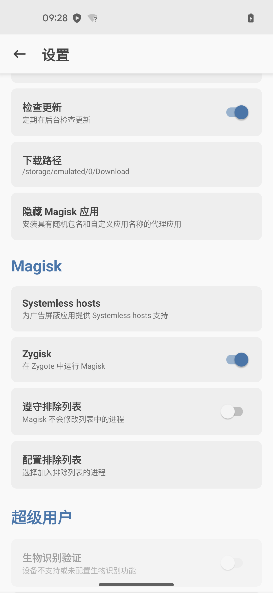
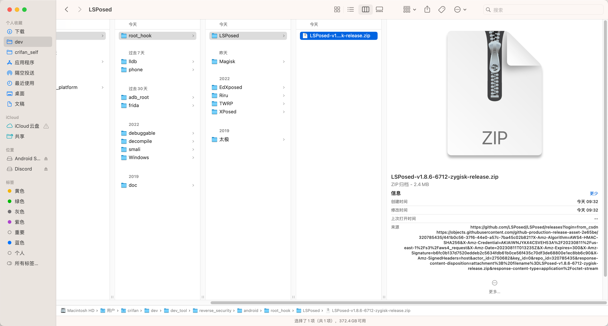
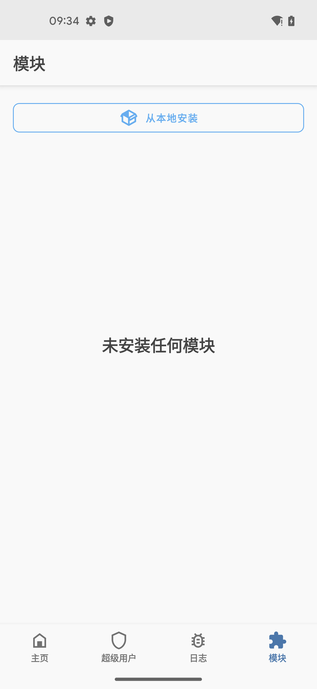
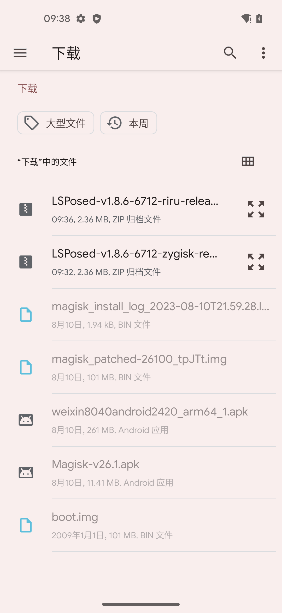
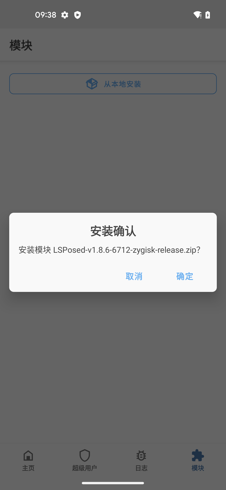
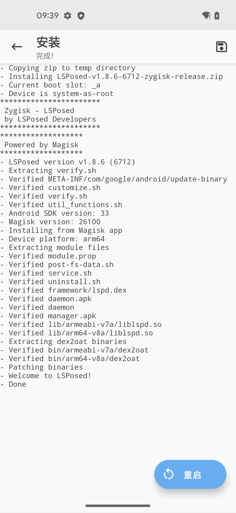
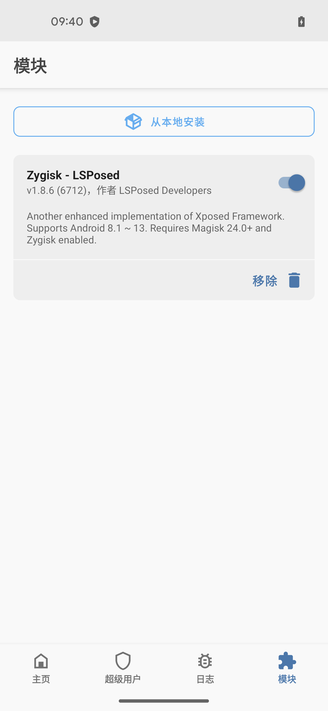

# 安装LSPosed

此处去给`Android 13`的`Google Pixel 5`安卓手机，去安装`LSPosed`：

* 安装LSPosed
  * 有2种模式
    * 基于`Riru`的
      * 安装方式
        * 很多教程都提到，分2步
          * 先安装`Riru-Core`
          * 再安装`Riru-LSPosed`
    * 基于`Zygisk`的
      * 安装方式
        * 直接安装：只需一步
          * Magisk中安装插件：`LSPosed-Zygisk`
            * Magisk中勾选：
              * `Zygisk`：在Zygote中运行Magisk

此处详细介绍第二种方式：

## Magisk中安装插件：LSPosed-Zygisk

先确保Magisk中：

* 已勾选：`Zygisk`
  * 

然后再去：Magisk中安装`LSPosed-Zygisk`插件

### 概述

* 从[LSPosed官网](https://github.com/LSPosed/LSPosed/releases)下载到最新版`LSPosed-v1.8.6-6712-zygisk-release.zip`，下载到手机中，再去`Magisk`中安装该插件，即可


* 注：
  * `LSPosed-Zygisk`，还有其他更新版本 == 如果需要，也可以使用更新的版本
    * `v1.9.3_mod`
      * [Releases · mywalkb/LSPosed_mod](https://github.com/mywalkb/LSPosed_mod/releases)
        * https://github.com/mywalkb/LSPosed_mod/releases/download/v1.9.3_mod/LSPosed-v1.9.3_mod-7244-zygisk-release.zip
    * `v1.10.1`
      * [Release LSPosed v1.10.1 · JingMatrix/LSPosed](https://github.com/JingMatrix/LSPosed/releases/tag/v1.10.1)
        * https://github.com/JingMatrix/LSPosed/releases/download/v1.10.1/LSPosed-v1.10.1-7115-zygisk-release.zip

### 详解

（1）下载LSPosed-Zygisk模块

从LSPosed的官网：[Releases · LSPosed/LSPosed (github.com)](https://github.com/LSPosed/LSPosed/releases)

找到并下载最新版

https://github.com/LSPosed/LSPosed/releases/download/v1.8.6/LSPosed-v1.8.6-6712-zygisk-release.zip

得到：`LSPosed-v1.8.6-6712-zygisk-release.zip`



（2）用adb下载到安卓手机中

```bash
adb push LSPosed-v1.8.6-6712-zygisk-release.zip /sdcard/Download/
```

* 输出举例
  ```bash
  ➜  LSPosed adb push LSPosed-v1.8.6-6712-zygisk-release.zip /sdcard/Download/
  LSPosed-v1.8.6-6712-zygisk-release.zip: 1 file pushed, 0 skipped. 53.5 MB/s (2362560 bytes in 0.042s)
  ```

（3）Magisk中本地安装LSPosed-Zygisk插件

* `Magisk`->`模块`->`从本地安装`->从下载目录找到并点击`LSPosed-v1.8.6-6712-zygisk-release.zip`->安装确认：`确定`->`重启`
  * `Magisk`->`模块`->`从本地安装`
    * 
  * 从下载目录找到并点击`LSPosed-v1.8.6-6712-zygisk-release.zip`
    * 
  * 安装确认：`确定`
    * 
  * 安装完成后，点击`重启`
    * 

即可在Magisk的模块中看到：

* 已安装：`Zygisk-LSPosed`模块
  * 
