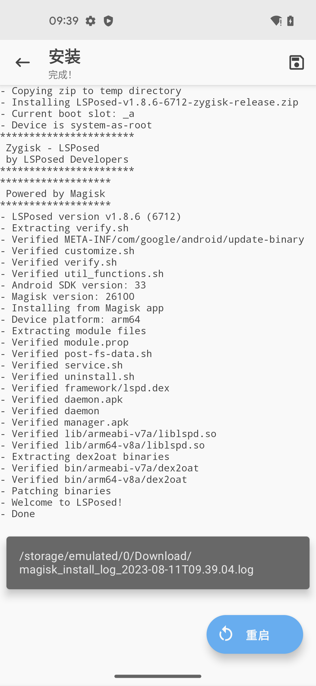
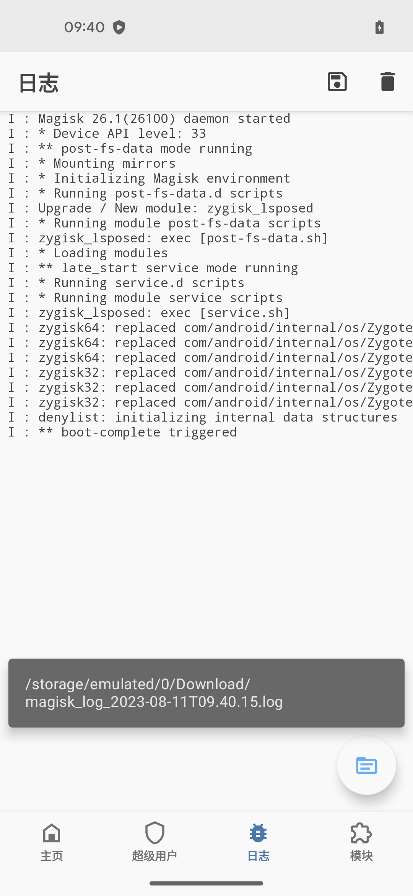

# LSPosed相关日志

## LSPosed安装过程日志

期间可以点击保存按钮，保存出log日志文件：



再去把log日志导出上传到电脑端：

```bash
➜  LSPosed adb pull /sdcard/Download/magisk_install_log_2023-08-11T09.39.04.log .
/sdcard/Download/magisk_install_log_2023-08-11T09.39.04.log: 1 file pulled, 0 skipped. 0.7 MB/s (4527 bytes in 0.006s)
```

查看到内容是：

* `magisk_install_log_2023-08-11T09.39.04.log`

```log
- Copying zip to temp directory
- Installing LSPosed-v1.8.6-6712-zygisk-release.zip
- Current boot slot: _a
- Device is system-as-root
Archive:  /data/user/0/com.topjohnwu.magisk/cache/flash/install.zip
  inflating: module.prop
***********************
 Zygisk - LSPosed 
 by LSPosed Developers 
***********************
Archive:  /data/user/0/com.topjohnwu.magisk/cache/flash/install.zip
  inflating: customize.sh
*******************
 Powered by Magisk 
*******************
Archive:  /data/user/0/com.topjohnwu.magisk/cache/flash/install.zip
  inflating: verify.sh
Archive:  /data/user/0/com.topjohnwu.magisk/cache/flash/install.zip
   creating: META-INF/com/google/android/
  inflating: META-INF/com/google/android/update-binary.sha256
  inflating: META-INF/com/google/android/updater-script.sha256
  inflating: META-INF/com/google/android/update-binary
  inflating: META-INF/com/google/android/updater-script
- LSPosed version v1.8.6 (6712)
- Extracting verify.sh
Archive:  /data/user/0/com.topjohnwu.magisk/cache/flash/install.zip
  inflating: customize.sh
Archive:  /data/user/0/com.topjohnwu.magisk/cache/flash/install.zip
  inflating: customize.sh.sha256
- Verified META-INF/com/google/android/update-binary
Archive:  /data/user/0/com.topjohnwu.magisk/cache/flash/install.zip
  inflating: verify.sh
Archive:  /data/user/0/com.topjohnwu.magisk/cache/flash/install.zip
  inflating: verify.sh.sha256
Archive:  /data/user/0/com.topjohnwu.magisk/cache/flash/install.zip
  inflating: util_functions.sh
- Verified customize.sh
- Verified verify.sh
Archive:  /data/user/0/com.topjohnwu.magisk/cache/flash/install.zip
  inflating: util_functions.sh.sha256
- Verified util_functions.sh
- Android SDK version: 33
- Magisk version: 26100
- Installing from Magisk app
- Device platform: arm64
- Extracting module files
Archive:  /data/user/0/com.topjohnwu.magisk/cache/flash/install.zip
  inflating: module.prop
Archive:  /data/user/0/com.topjohnwu.magisk/cache/flash/install.zip
  inflating: module.prop.sha256
Archive:  /data/user/0/com.topjohnwu.magisk/cache/flash/install.zip
  inflating: post-fs-data.sh
- Verified module.prop
Archive:  /data/user/0/com.topjohnwu.magisk/cache/flash/install.zip
  inflating: post-fs-data.sh.sha256
Archive:  /data/user/0/com.topjohnwu.magisk/cache/flash/install.zip
  inflating: service.sh
Archive:  /data/user/0/com.topjohnwu.magisk/cache/flash/install.zip
  inflating: service.sh.sha256
- Verified post-fs-data.sh
Archive:  /data/user/0/com.topjohnwu.magisk/cache/flash/install.zip
  inflating: uninstall.sh
Archive:  /data/user/0/com.topjohnwu.magisk/cache/flash/install.zip
  inflating: uninstall.sh.sha256
- Verified service.sh
- Verified uninstall.sh
Archive:  /data/user/0/com.topjohnwu.magisk/cache/flash/install.zip
  inflating: framework/lspd.dex
Archive:  /data/user/0/com.topjohnwu.magisk/cache/flash/install.zip
  inflating: framework/lspd.dex.sha256
- Verified framework/lspd.dex
Archive:  /data/user/0/com.topjohnwu.magisk/cache/flash/install.zip
  inflating: daemon.apk
Archive:  /data/user/0/com.topjohnwu.magisk/cache/flash/install.zip
  inflating: daemon.apk.sha256
- Verified daemon.apk
Archive:  /data/user/0/com.topjohnwu.magisk/cache/flash/install.zip
  inflating: daemon
Archive:  /data/user/0/com.topjohnwu.magisk/cache/flash/install.zip
  inflating: daemon.sha256
- Verified daemon
Archive:  /data/user/0/com.topjohnwu.magisk/cache/flash/install.zip
  inflating: manager.apk
Archive:  /data/user/0/com.topjohnwu.magisk/cache/flash/install.zip
  inflating: manager.apk.sha256
- Verified manager.apk
Archive:  /data/user/0/com.topjohnwu.magisk/cache/flash/install.zip
  inflating: liblspd.so
Archive:  /data/user/0/com.topjohnwu.magisk/cache/flash/install.zip
  inflating: liblspd.so.sha256
- Verified lib/armeabi-v7a/liblspd.so
Archive:  /data/user/0/com.topjohnwu.magisk/cache/flash/install.zip
  inflating: liblspd.so
Archive:  /data/user/0/com.topjohnwu.magisk/cache/flash/install.zip
  inflating: liblspd.so.sha256
- Verified lib/arm64-v8a/liblspd.so
- Extracting dex2oat binaries
Archive:  /data/user/0/com.topjohnwu.magisk/cache/flash/install.zip
  inflating: dex2oat
Archive:  /data/user/0/com.topjohnwu.magisk/cache/flash/install.zip
  inflating: dex2oat.sha256
- Verified bin/armeabi-v7a/dex2oat
Archive:  /data/user/0/com.topjohnwu.magisk/cache/flash/install.zip
  inflating: dex2oat
Archive:  /data/user/0/com.topjohnwu.magisk/cache/flash/install.zip
  inflating: dex2oat.sha256
- Verified bin/arm64-v8a/dex2oat
- Patching binaries
- Welcome to LSPosed!
- Done
```

供参考。

## Magisk启动日志带LSPosed

Magisk重启后，相关日志中，能看到LSPosed字样：

* `zygisk_lsposed: exec [service.sh]`

也去点击保存按钮，保存出日志文件：



导出日志文件：

```bash
➜  LSPosed adb pull /sdcard/Download/magisk_log_2023-08-11T09.40.15.log .
/sdcard/Download/magisk_log_2023-08-11T09.40.15.log: 1 file pulled, 0 skipped. 11.3 MB/s (96550 bytes in 0.008s)
```

可以看到：log日志内容很多。

此处只摘录相关的核心日志：

```log
---Magisk Logs---
26.1 (26100)

03-18 05:03:44.576   964   964 I : Magisk 26.1(26100) daemon started
03-18 05:03:44.578   964   964 I : * Device API level: 33
03-18 05:03:44.587   964   966 I : ** post-fs-data mode running
03-18 05:03:44.587   964   966 I : * Mounting mirrors
03-18 05:03:44.625   964   966 I : * Initializing Magisk environment
03-18 05:03:44.638   964   966 I : * Running post-fs-data.d scripts
03-18 05:03:44.641   964   966 I : Upgrade / New module: zygisk_lsposed
03-18 05:03:44.641   964   966 I : * Running module post-fs-data scripts
03-18 05:03:44.642   974   974 I : zygisk_lsposed: exec [post-fs-data.sh]
03-18 05:03:44.658   964   966 I : * Loading modules
08-11 09:39:34.139   964   966 I : ** late_start service mode running
08-11 09:39:34.139   964   966 I : * Running service.d scripts
08-11 09:39:34.141   964   966 I : * Running module service scripts
08-11 09:39:34.143   964   966 I : zygisk_lsposed: exec [service.sh]
08-11 09:39:34.255  1015  1015 I : zygisk64: replaced com/android/internal/os/Zygote#nativeForkAndSpecialize
08-11 09:39:34.255  1015  1015 I : zygisk64: replaced com/android/internal/os/Zygote#nativeForkSystemServer
08-11 09:39:34.255  1015  1015 I : zygisk64: replaced com/android/internal/os/Zygote#nativeSpecializeAppProcess
08-11 09:39:34.554  1016  1016 I : zygisk32: replaced com/android/internal/os/Zygote#nativeForkAndSpecialize
08-11 09:39:34.554  1016  1016 I : zygisk32: replaced com/android/internal/os/Zygote#nativeForkSystemServer
08-11 09:39:34.554  1016  1016 I : zygisk32: replaced com/android/internal/os/Zygote#nativeSpecializeAppProcess
08-11 09:39:36.110   964   966 I : denylist: initializing internal data structures
08-11 09:39:47.041   964   966 I : ** boot-complete triggered
```

供参考。
