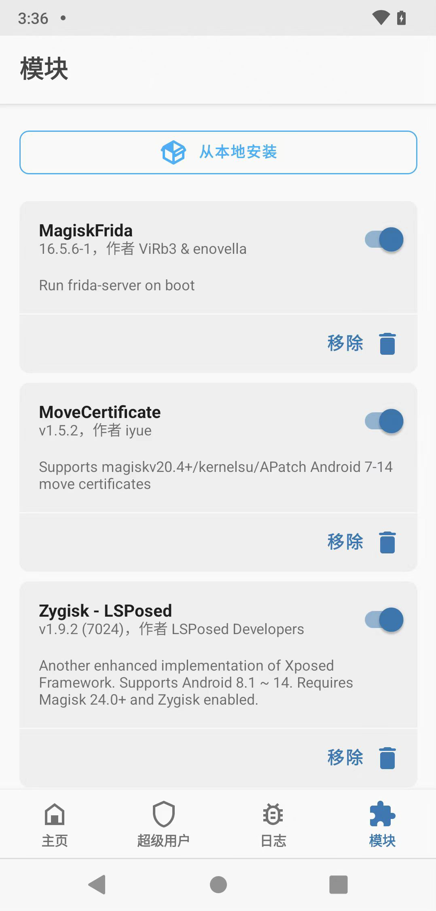
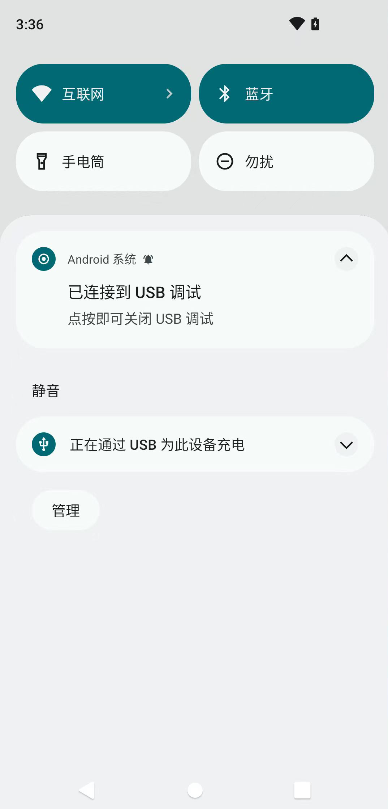
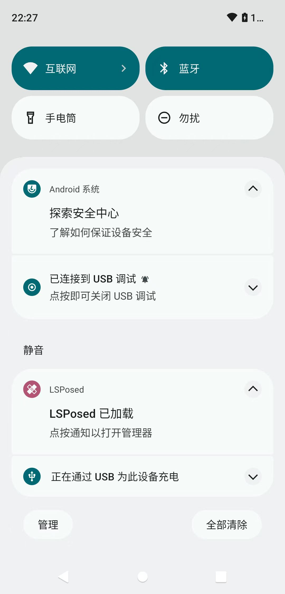
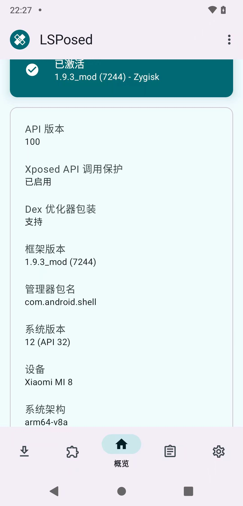
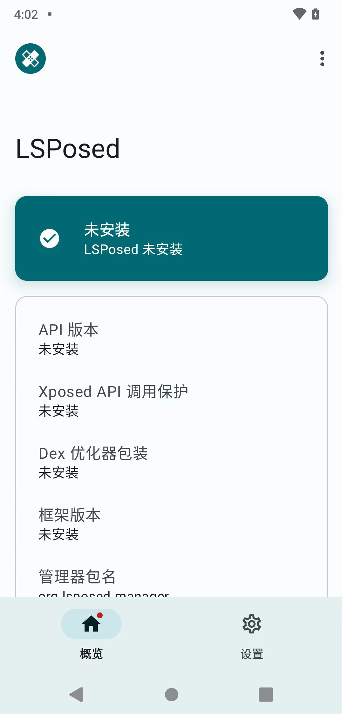

# LSPosed常见问题

## 安装LSPosed插件并重启后：系统通知栏中没有

* 现象

Magisk（Kitsune Mask）中正常安装了LSPosed的插件：`Zygisk - LSPosed`：



但是重启安卓手机后：

系统通知中，并没有LSPosed的通知：



* 原因
  * 当前安卓系统有问题
    * 当前安卓系统的ROM是，别人基于`LineageOS v19.1`去自定义的
    * 其中内部改动，导致一些兼容性问题
    * 具体技术细节是
      * StatFs的Mock，对于Zygote不太兼容
        * Magisk中的Zygisk（Zygote）框架，加载后的uid，可能和常规的第三方app不同
        * 导致其被Mock了，导致Zygisk异常，导致LSPosed异常
    * 最终导致此处LSPosed无法正常工作
* 解决办法
  * 方法1：让别人去修复自定义的LineageOS的ROM中的源码，使得：正常支持LSPosed（的Zygote）
  * 方法2：重新刷官网的LineageOS的系统，其是支持LSPosed的
    * 注：
      * 官网`LineageOS v19.1`的ROM下载
        * （小米8，对应的）LineageOS的官网 [LineageOS Downloads](https://download.lineageos.org/devices/dipper/builds) 只有dipper的最新版：`v21`，没有`v19`
        * 从[网上](https://lineage-archive.timschumi.net)找到了
          * https://lineage-archive.timschumi.net/build/2878
            * https://b4.timschumi.net/lineage-archive/lineage-19.1-20221223-nightly-dipper-signed.zip
* 解决后==正常现象
  * 重启后，系统通知中，即可出现LSPosed
    * LSPosed已加载，点按通知以打开管理器
      * 
  * 后续点击打开`LSPosed`后，即可显示：
    * 已激活
      * 

## LSPosed显示：未安装

* 现象
  * LSPosed的app安装后，显示：未安装：
    * 
* 原因
  * 表面原因：LSPosed的app安装出现异常
  * 实际原因：其实就是上面的，当前安卓系统ROM本身有问题，导致LSPosed异常
* 解决办法
  * 先去解决上面的，安卓ROM异常的问题
    * 然后LSPosed就正常了

## 备注

只是，另外，还有一些，和LSPosed的Manager的app相关的内容，值得整理：

### 拨打特殊电话号码，以打开LSPosed的Manager的app界面

此处LSPosed中的Manager的app界面，如果由于其他特殊原因，没有打开，则可以通过：

* 电话拨号 `*#*#5776733#*#*`

就可以，启动LSPosed的Manager的app的界面了

### 自己手动安装LSPosed的Manager的app

（前提：本身LSPosed的框架是正常的，而只是）LSPosed的Manager的app：由于某些特殊原因，未正常安装

则可以：自己手动去安装LSPosed的Manager的app

#### 找到manager.apk

先要找到

* 安卓中LSPosed的Manager的app的安装文件
  * `manager.apk`
    * 的位置
      * 旧版位置：`/data/adb/lspd/manager.apk`
      * 新版位置：`/data/adb/modules/zygisk_lsposed/manager.apk`

#### 安装manager.apk

电脑端用adb从安卓中pull导出：

```bash
adb pull /data/adb/modules/zygisk_lsposed/manager.apk .
```

再在电脑端用adb去install即可。

```bash
adb install manager.apk
```
