# LSPosed界面和功能

## LSPosed桌面logo

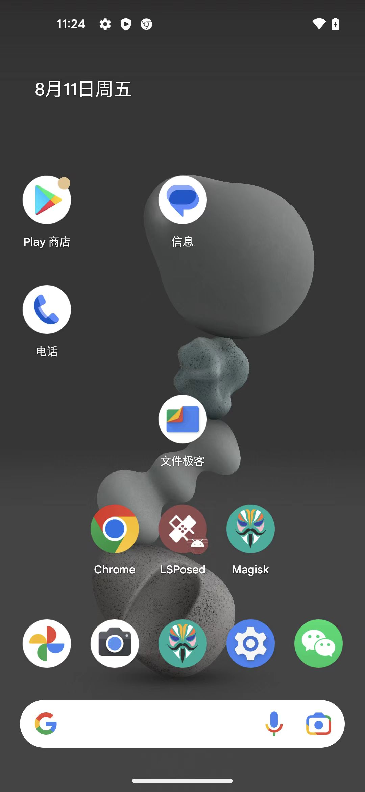

## LSPosed主界面=主页

点击桌面logo，进入，打开主页=主界面：

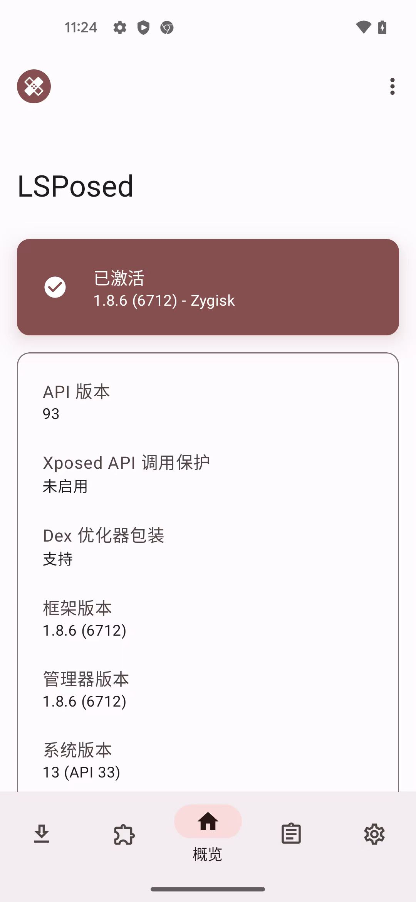

下拉可看到更多内容：

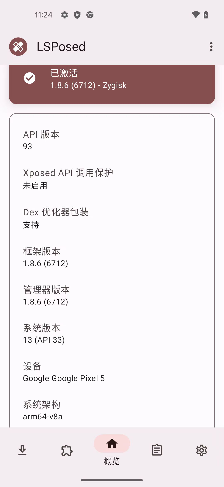

### 复制内容

可以点击复制：

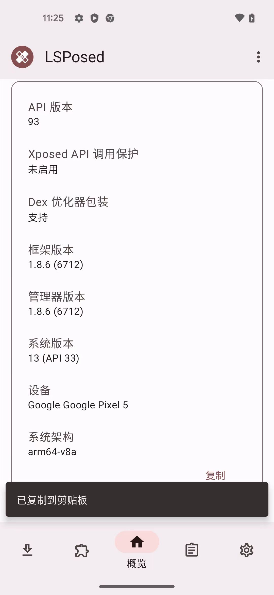

复制出文本内容：

* API 版本：93
* Xposed API 调用保护：未启用
* Dex 优化器包装：支持
* 框架版本：1.8.6 (6712)
* 管理器版本：1.8.6 (6712)
* 系统版本：13 (API 33)
* 设备：Google Google Pixel 5
* 系统架构：arm64-v8a

### 设置

主页中，右上角 三个点，点击后可以看到：

* 反馈或建议
* 关于

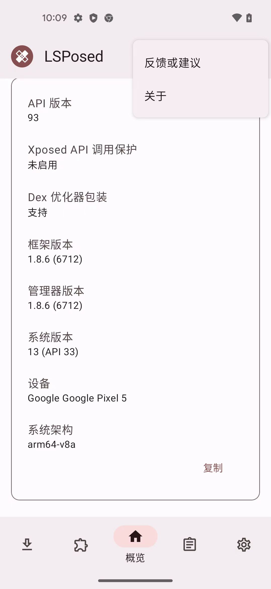

#### 关于

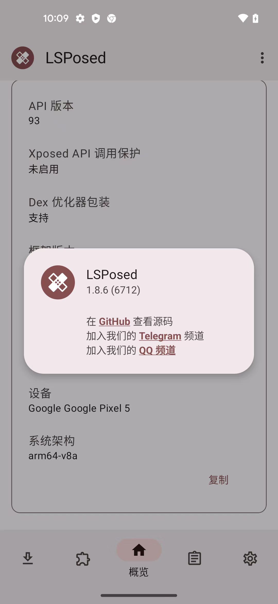

## 日志

日志 -> 默认显示：模块日志：

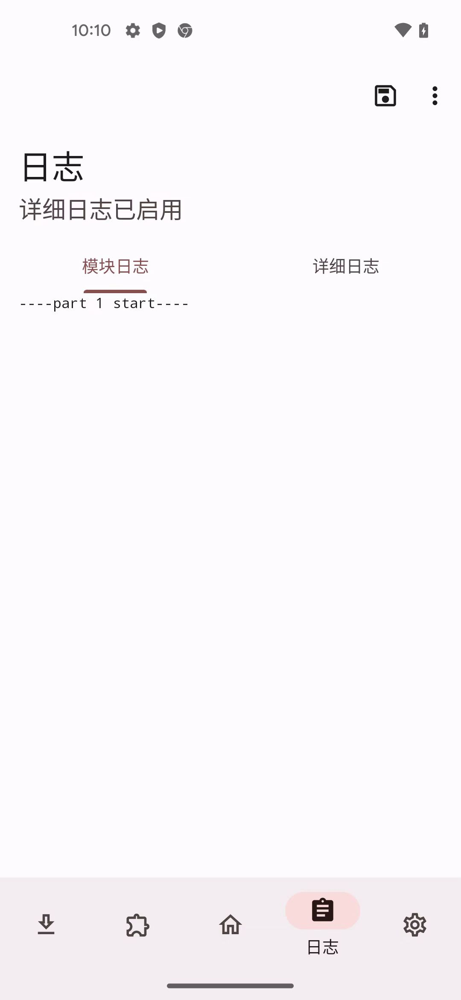

点击 切换到 详细日志：

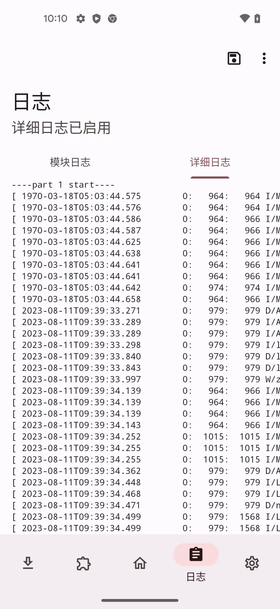

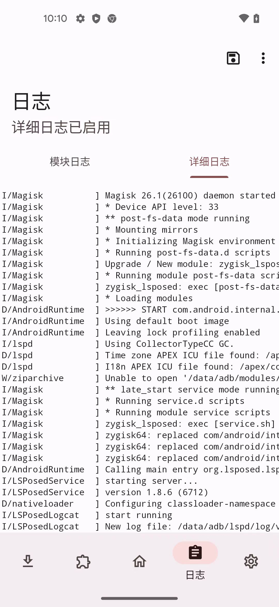

### 日志选项

继续日志页面，右上角三个点，点击后可以看到各种设置：

* 滚动到顶部
* 滚动到底部
* 立即清空日志
* 自动换行

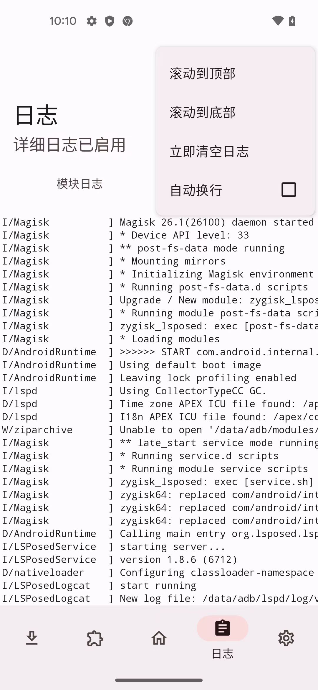

-》 勾选：自动换行 后的效果：

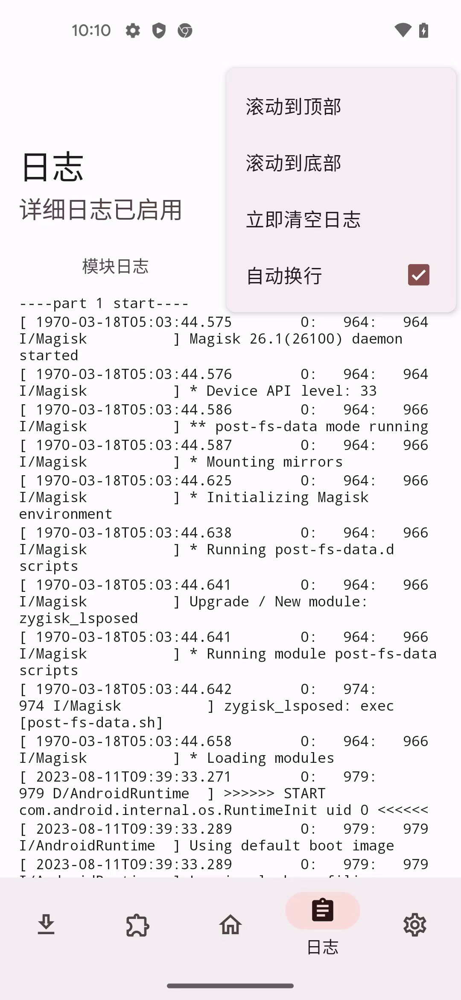

## 仓库

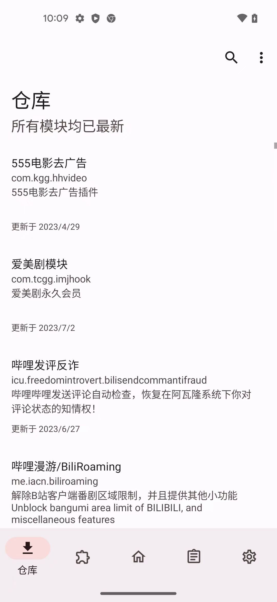

## 模块

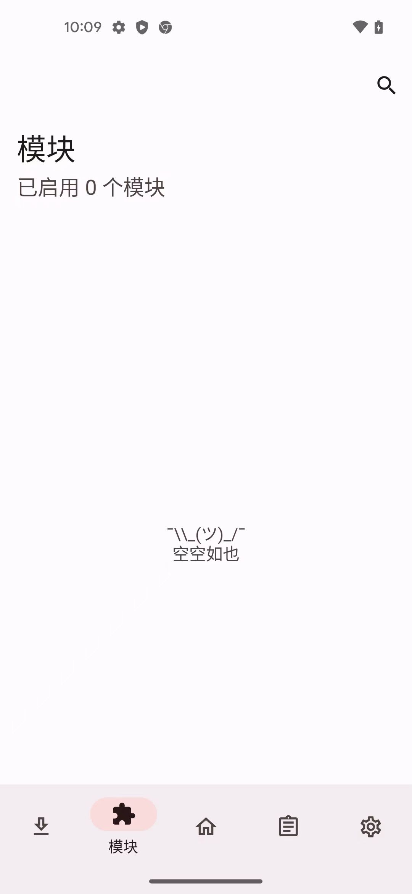

## 设置

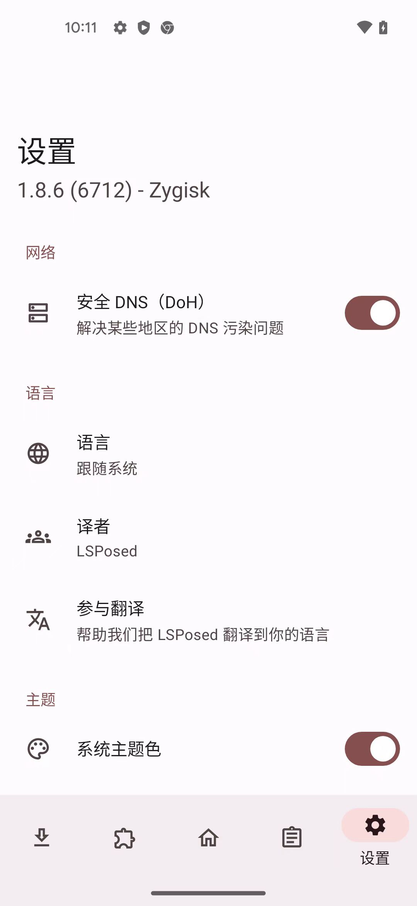

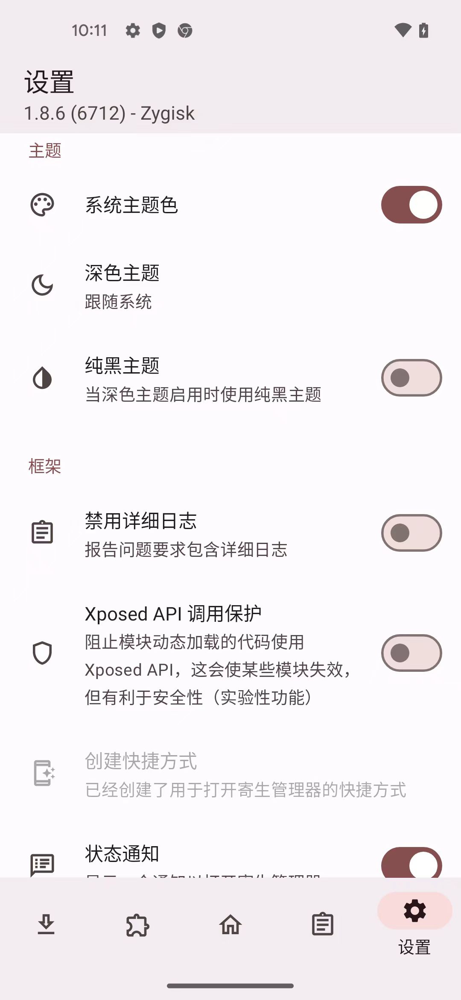

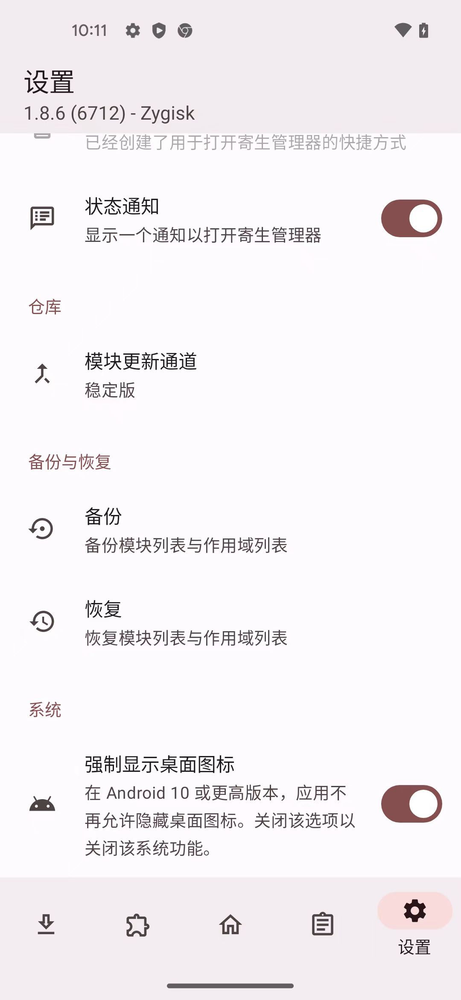
