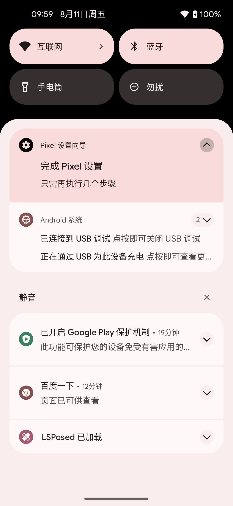
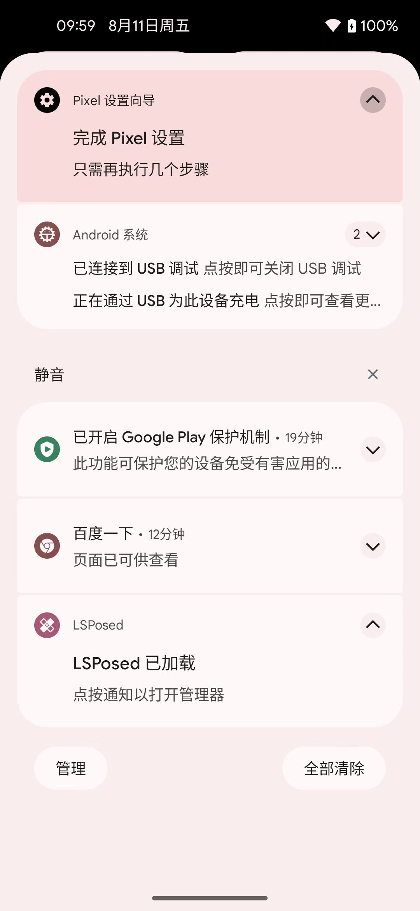
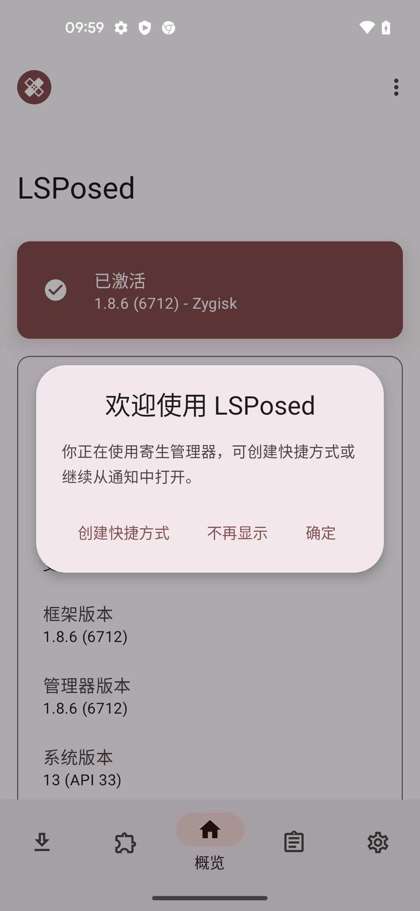
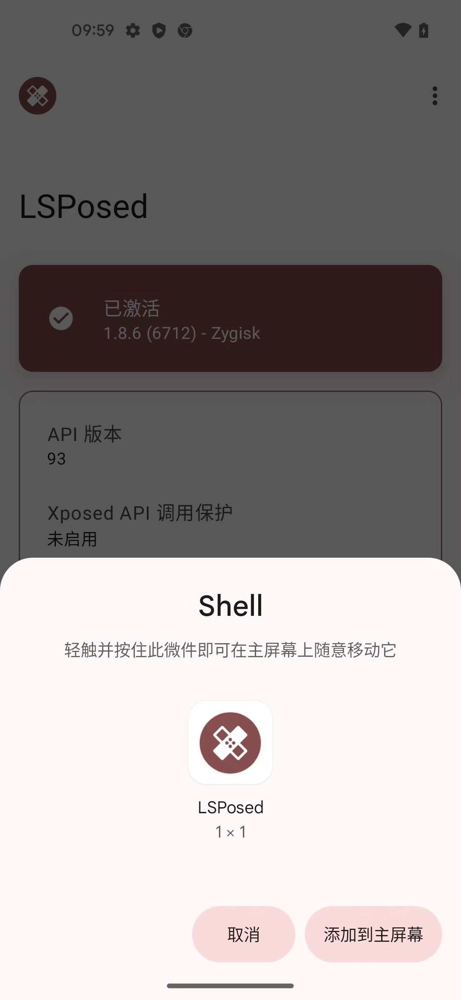
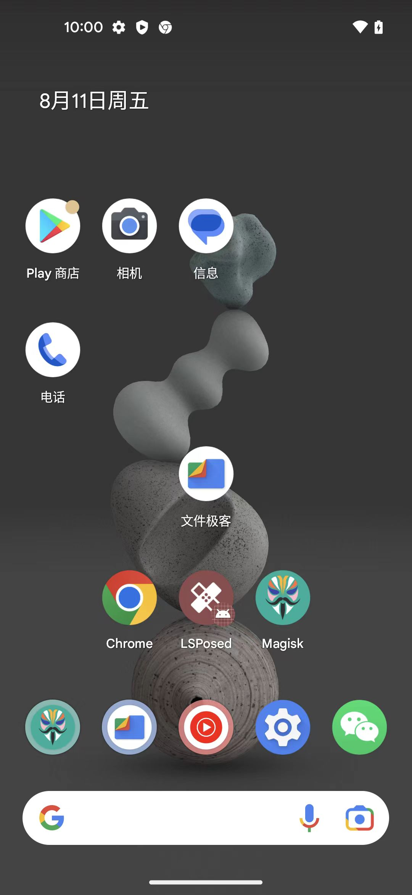
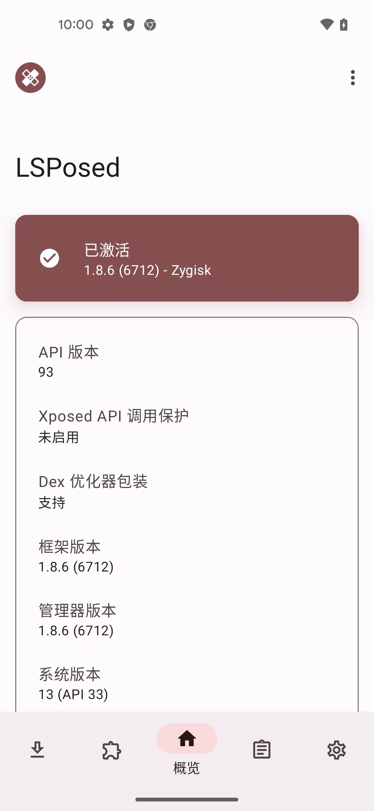

# 打开LSPosed的app

* LSPosed的app=LSPosed Manager=LSPosed管理器
  * 之前是有独立的app的：`LSPosed Manager`
  * 现在：好像无需安装独立的LSPosed Manager的app，而是：
    * 从**系统通知**中打开`LSPosed的app`

## 从系统通知中打开LSPosed的app

### 概述

* 安装好LSPosed后，从系统通知中，点击打开LSPosed的app，后续根据提示，点击创建快捷方式（微件），放到系统桌面，作为普通安卓app使用：点击即可打开LSPosed的app

### 详细步骤

* Android系统通知 -> LSPosed已加载
  * 
* ->点按通知以打开管理器
  * 
* -> 打开了 LSPosed的app
  * -> 首次打开会出现提示：
    * 欢迎使用LSPosed，你正在使用寄生管理器，可创建快捷方式或继续从通知中打开。  创建快捷方式  不再显示 确定
      * 
  * -> 点击 创建快捷方式
* -> 出现 Shell弹框，点击：添加到主屏幕
  * 
* -> 系统桌面即可出现新图标：LSPosed
  * 
  * 注：app的logo图标右下角带个安卓小logo，估计就表示是 微件的意思
* -> 以后即可点击系统桌面图标LSPosed，即可打开启动LSPosed的app
  * 
