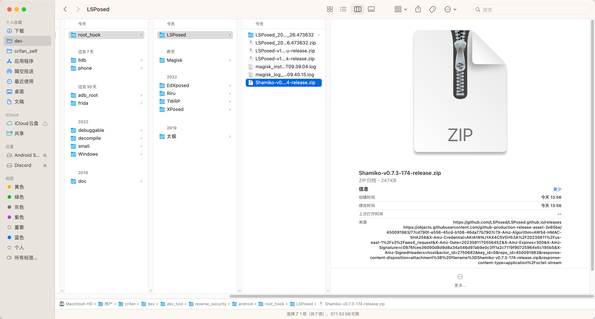
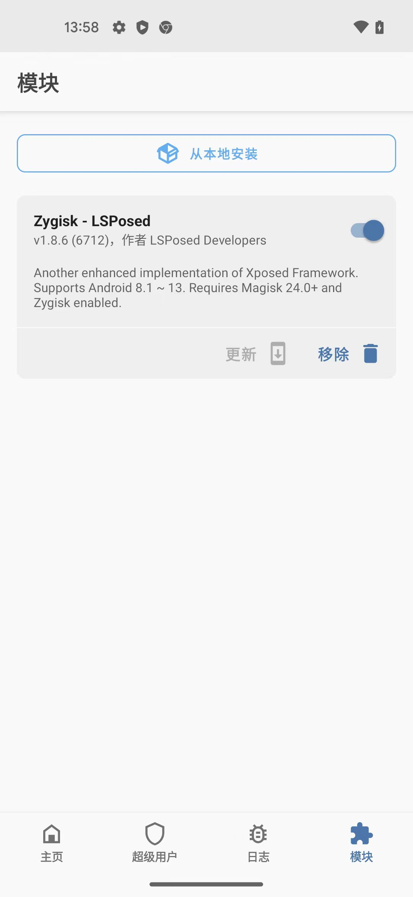
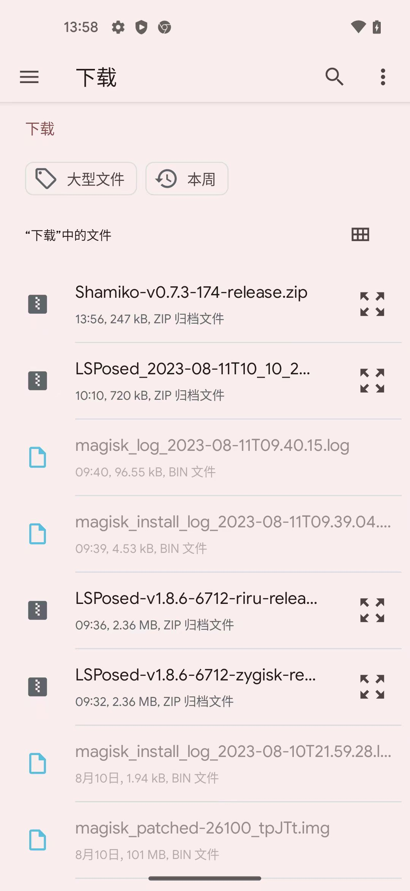
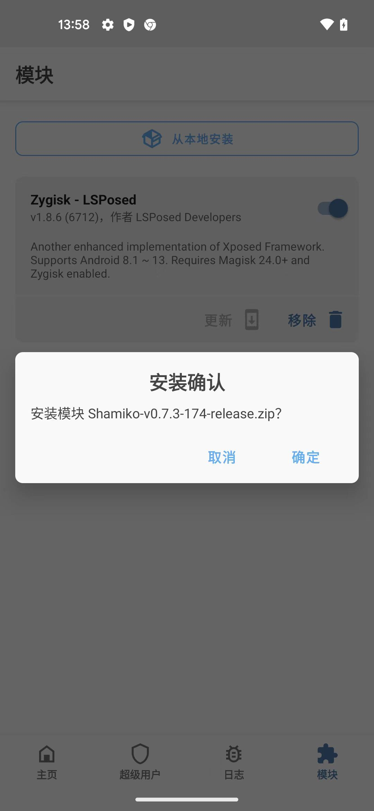
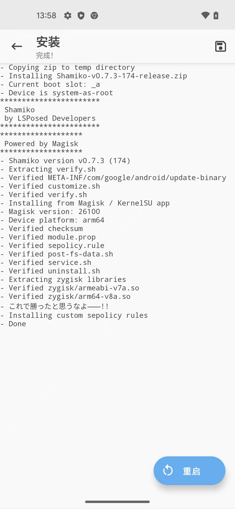
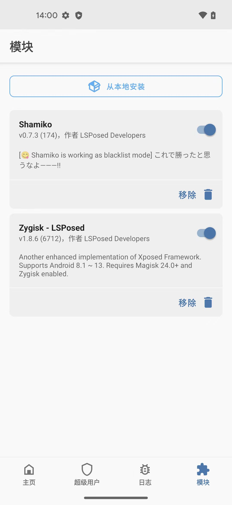

# MagiskHide替代方案：Shamiko模块

* 背景：
  * 之前Magisk有个`MagiskHide`的模块
    * 功能：实现隐藏root -> 避免别的app检测到安卓已root
      * 功能很好用
  * 但是由于Magisk `24.0+`移除了`MagiskHide`，因此提供一个替代的隐藏root的方案：`Shamiko模块`

## 下载和安装`Shamiko`模块
* 下载到电脑
  * [LSPosed Official Website | LSPosed.github.io](https://lsposed.org/)
    * [Releases · LSPosed/LSPosed.github.io](https://github.com/LSPosed/LSPosed.github.io/releases)
      * 找到最新版
        * https://github.com/LSPosed/LSPosed.github.io/releases/download/shamiko-174/Shamiko-v0.7.3-174-release.zip
      * 下载得到：`Shamiko-v0.7.3-174-release.zip`
        * 
* 传输下载到安卓手机
  ```bash
  ➜  LSPosed adb push Shamiko-v0.7.3-174-release.zip /sdcard/Download/
  Shamiko-v0.7.3-174-release.zip: 1 file pushed, 0 skipped. 327.6 MB/s (247141 bytes in 0.001s)
  ```
* 去`Magisk`中安装Shamiko模块
  * 打开Magisk->模块->从本地安装
    * 
  * 点选`Shamiko-v0.7.3-174-release.zip`
    * 
  * 安全确认：确定
    * 
  * 开始安装，直到安装完成，点击`重启`
    * 
  * 重启Magisk后，即可看到：已安装的模块`Shamiko`
    * 
