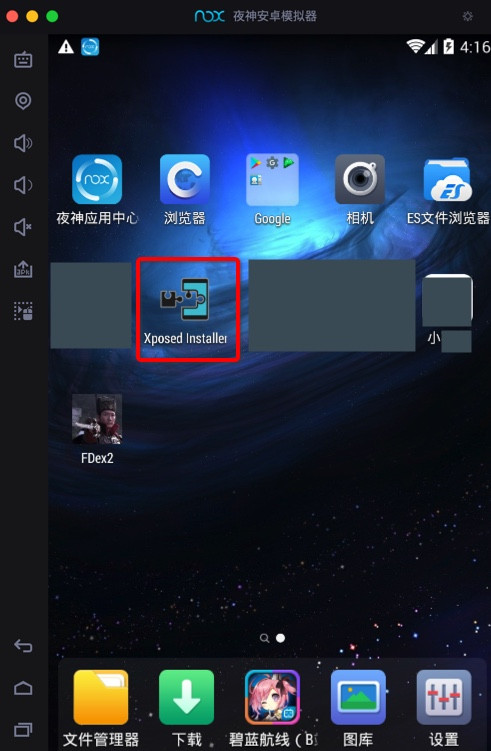

# 安装XPosed Installer

TODO：

* 【已解决】Mac中夜神安卓模拟器中安装Xposed框架
* 【记录】给二手已root小米4设置Charles代理和安装Charles证书和启用Xposed
* 【已解决】用WrBug的DumpDex从app中hook导出dex文件
* 【未解决】小米4中尝试安装最新3.1.5的Xposed Installer去解决2.6版本提示的不兼容的问题
* 【已解决】mac中试用FDex2去hook导出安卓app的dex等文件
* 【已解决】Android 4.4.4的小米4Xposed Installer出错：Xposed目前不兼容Android SDK版本19或您的处理器架构armeabi-v7a
* 【已解决】Mac中夜神模拟器中安装Xposed框架
* 【已解决】价格便宜但支持root的Android手机
* 【已解决】如何确定此二手小米4是否的确已经root
* 【记录】二手已root的小米4安卓手机照片和信息
* 【已解决】小米4的MIUI系统自动升级导致清楚已有root权限后如何恢复root权限
* 【已解决】小米4中重新安装Xposed Installer和激活Xposed框架

------

* 说明
  * `旧版本的Xposed` == `Xposed Installer`
* 如何安装`Xposed Installer`
  * 一般是通过`Xposed Installer`=`Xposed安装器`来安装`Xposed框架`，安装到安卓系统中
    * Xposed Installer
      * 可以理解为是一个**特殊**的安卓的应用
        * 专门用来安装Xposed框架
* 被安装的安卓系统
  * 可以用`安卓模拟器`
    * 安卓模拟器有很多，不是所有的都能成功安装
      * 尝试过
        * `网易MuMu`
          * 运行速度不错，但不支持设置Wifi代理
            * 详见
              * 【未解决】Mac中用Charles抓包网易Mumu安卓模拟器中Android的app
        * `Andy`
          * 安装后无法正常运行
            * 详见
              * 【未解决】Mac中尝试用Andy安卓模拟器去供Charles抓包Android中app的数据
      * 最终跑通的路是
        * Mac版`夜神安卓模拟器`
          * 基于`Android 4.4.2`
            * -》找到了匹配的`2.7`（或更低的`2.6`等）版本的`Xposed Installer`，即可安装
              * 
            * 注：更高的`3.x`版本，比如`3.5.1`，不支持`Android 4.4`，只支持`Android 5`
              * 详见
                * 【已解决】Mac中夜神安卓模拟器中安装Xposed框架
                  * [安装XPosed框架 · 好用的安卓模拟器：夜神Nox (crifan.org)](https://book.crifan.org/books/good_android_emulator_nox/website/usage/mac/install_xposed.html)
                * 【已解决】Mac中夜神模拟器中安装Xposed模块：JustTrustMe
  * 也可以用`安卓真机`
    * 但前提是：安卓手机要有root权限
      * 但（2019年及之后）很难买到支持root权限的手机
        * 之前跑通的路是
          * 淘宝上买的**二手**的**已root**的`小米4`，型号：`MI 4LTE-CU`，系统：`Android 4.4.4`
            * 注意：
              * 在无端被`MIUI`自动升级（从`5.8.5`升级为`7.5.12.17`）而丢失了卖家预装好的`Xposed Installer`之后，再去费了番功夫想办法重新安装可用的`Xposed`，最终思路是：
                * 网上找到了某大神`SolarWarez`修改后的`2.6`的版本的`Xposed`：
                  * `XposedInstaller_v2.6.1_by_SolarWarez_20151129.apk`
                * 才得以成功安装
                * 激活Xposed后，即可正常安装`JustTrustMe`等模块
                  * 最终实现`SSL pinning`的绕开/禁止的效果
                    * 就可以全部看到https解密后的明文了
                * 详见
                  * 【已解决】小米4中重新安装Xposed Installer和激活Xposed框架
                  * 【记录】给二手已root小米4设置Charles代理和安装Charles证书和启用Xposed

> #### warning:: 注意手机有变砖可能
> 
> 刷xposed框架会修改系统文件，所以可能会导致手机变砖，系统崩溃。以及刷成功后系统变卡变慢。并且不保证每台机器都可以刷成功，请自行评估在决定是否安装
> 
> -》不建议在自己的（常用）手机中装XPosed，因为很容易导致变砖
> 
> -》建议在安卓模拟器上，或者其他开发专用的安卓机上装`XPosed`
> 
> -》或者也可以在自己手机或开发专用安卓机中**免root**安装`VirtualXposed`或`太极`
> 
> 因为免root不会导致系统崩溃或手机变砖
