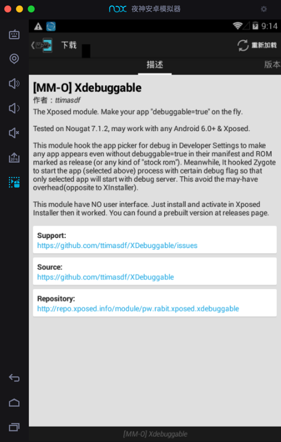

# 让app可调试的插件

## `Xdebuggable`

* Xdebuggable
  * 旧页面：均已失效
    * [[MM-O] Xdebuggable | Xposed Module Repository](https://repo.xposed.info/module/pw.rabit.xposed.xdebuggable)
      * 旧版Xposed可以搜到相关插件
        * 
      * apk下载地址：
        * https://dl-xda.xposed.info/modules/pw.rabit.xposed.xdebuggable_v4_c319ea.apk
  * 新来源
    * https://github.com/ttimasdf/XDebuggable
      * apk下载
        * https://github.com/ttimasdf/XDebuggable/releases
          * 举例
            * https://github.com/ttimasdf/XDebuggable/releases/download/v1.3/app-release.apk

## XAppDebug

* XAppDebug
  * Github
    * https://github.com/Palatis/XAppDebug
      * 下载
        * https://github.com/Palatis/XAppDebug/releases
  * LSPosed插件页面
    * XAppDebug - Xposed Module Repository
      * https://modules.lsposed.org/module/tw.idv.palatis.xappdebug
