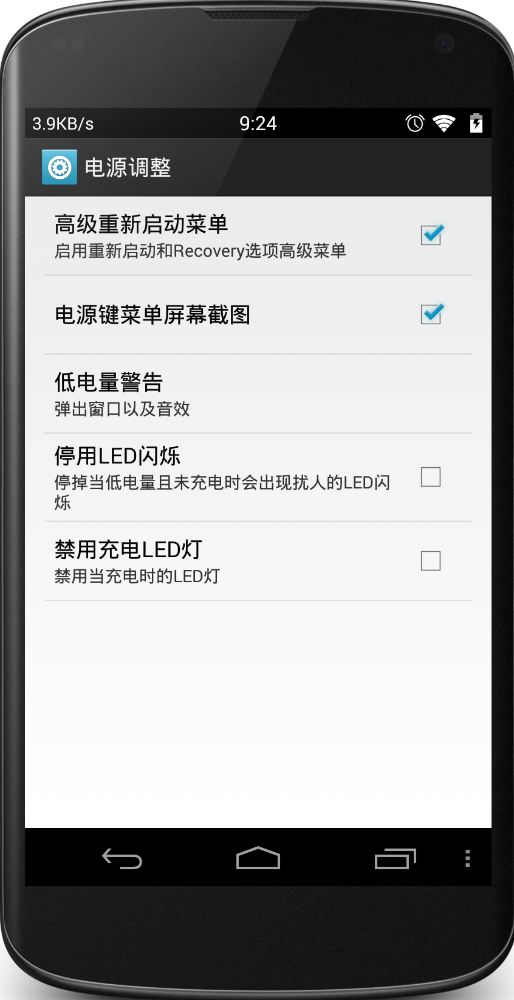
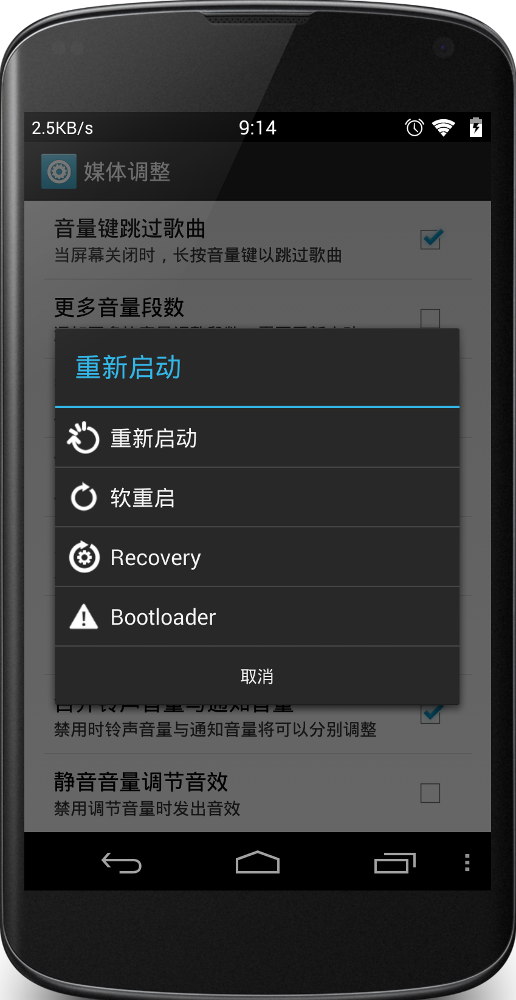
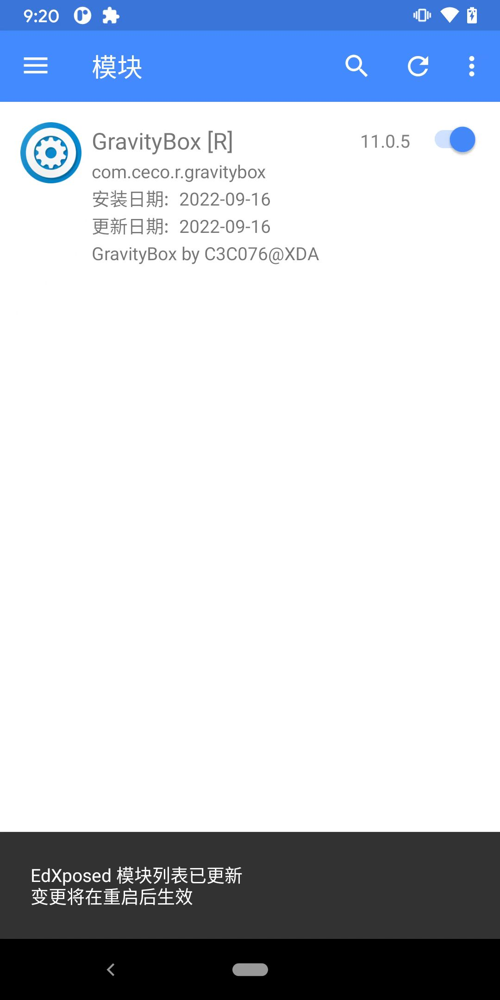
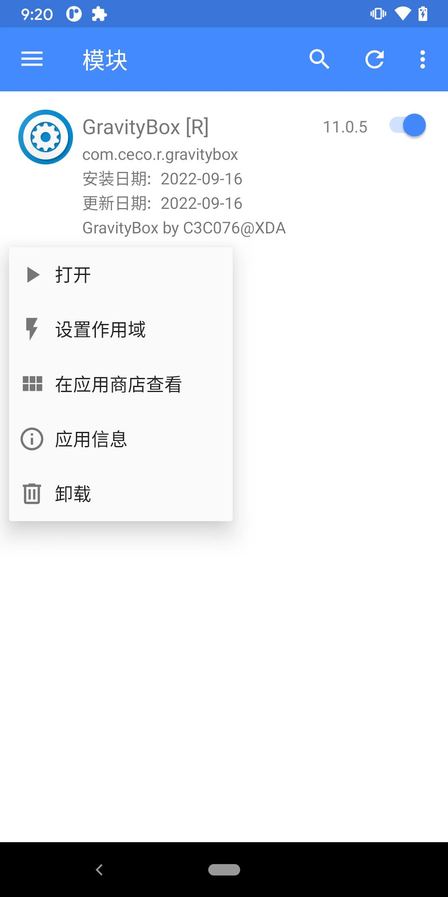
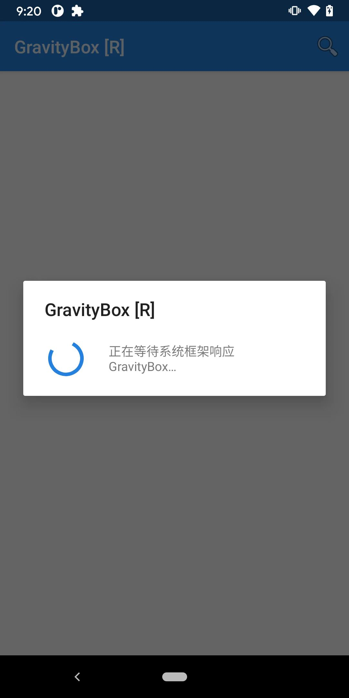
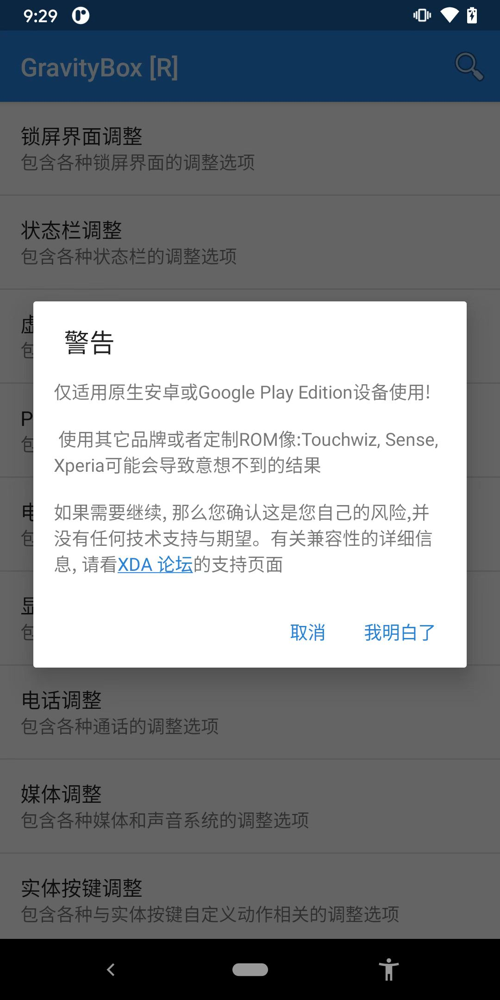
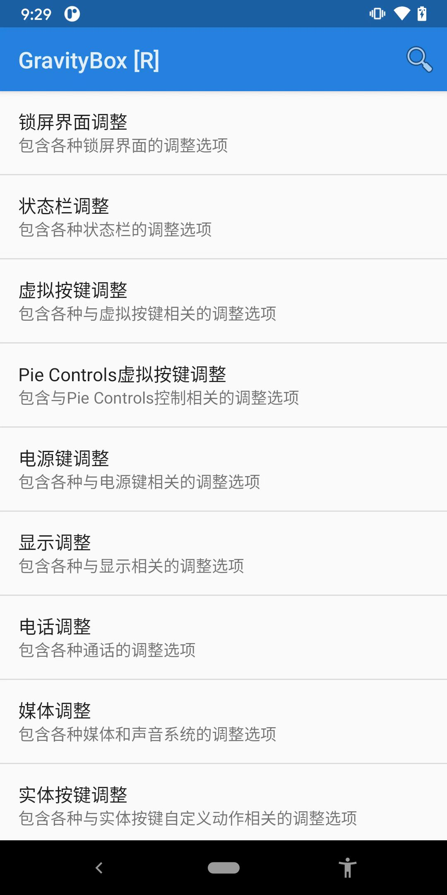
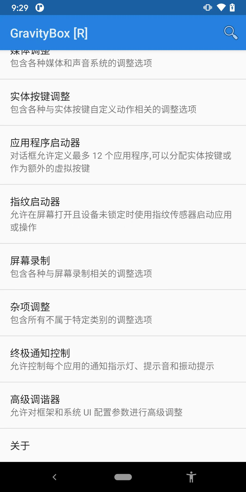
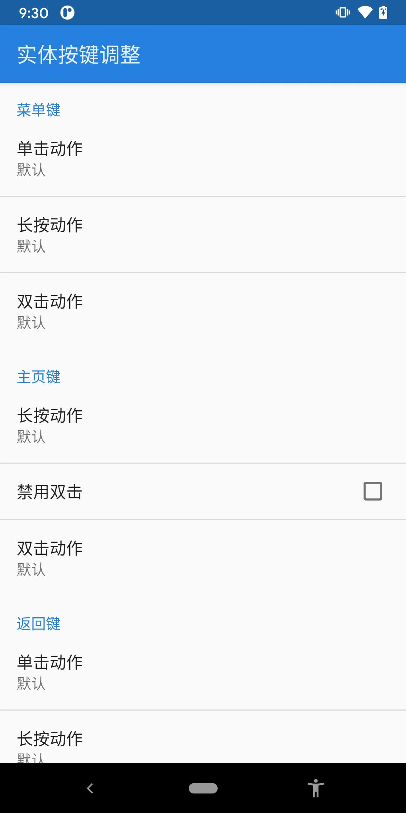
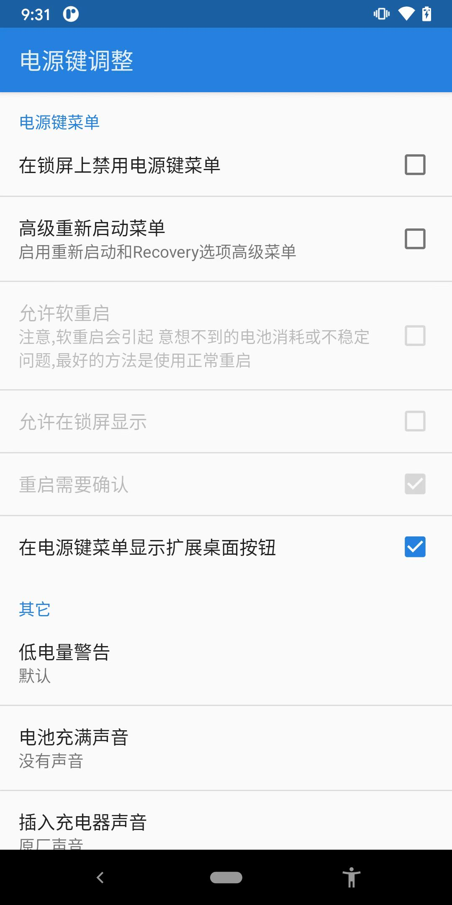

# GravityBox

* GravityBox
  * 是什么：Xposed插件
  * 作用
    * 各种功能
      * 从更改锁定屏幕、状态栏的颜色（及其透明度）、修改标准的最小和最大亮度级别、停用烦人的图标、建立扩展桌面模式等等
    * 其他比如
      * 更改赋予 Android 终端硬件按钮的功能
      * 修改状态栏的外观和显示的选项
      * 改变可以在手机或平板电脑屏幕上显示的亮度（这个是积极的，尤其是最小的，以节省电池）
      * 直接应用程序分配给设备的触摸按钮
      * 管理终端 RAM 的使用，了解此应用程序的消耗
      * 修改锁屏
      * 即使显示桌面也能旋转屏幕
    * 其他介绍
      * 安卓4.4电池图标美化、状态栏图标美化、时间居中显示、支持数字电量、全局透明度开启、隐藏SIM卡提示和显示、增加高级电源菜单、修改快捷下拉栏、简单开启虚拟按键功能、自带按键救星功能、关机菜单加入截屏功能、旧式电视CRT关屏特效、恢复开发者选项、锁屏快速程序启动
      * 重力工具箱GravityBox是一款依赖Xposed框架支持的全能系统工具，支持修改ROM的部分系统级重要参数
      * Xposed框架上必备神器级模块，软件是原生支持中文版本，可以修改和定制非常多系统级的功能。原生这个工具只能用于MTK平台，现在作者已经将它弄成通用的了
  * 截图
    * 
    * 

## 试用GravityBox

从[Github的release页面](https://github.com/GravityBox/GravityBox/releases)下载到apk：

https://github.com/GravityBox/GravityBox/releases/download/v11.0.5_r/GravityBox_R_11.0.5.apk

然后安装，安装后可以在`EdXposed Manager`中看到Xposed插件，点击开启：

更多选项：

点击打开：

首次有警告弹框：

主界面可以看到各种功能：

然后记录点相关功能：

* 实体按键调整
  * 
* 电源键调整
  * 
