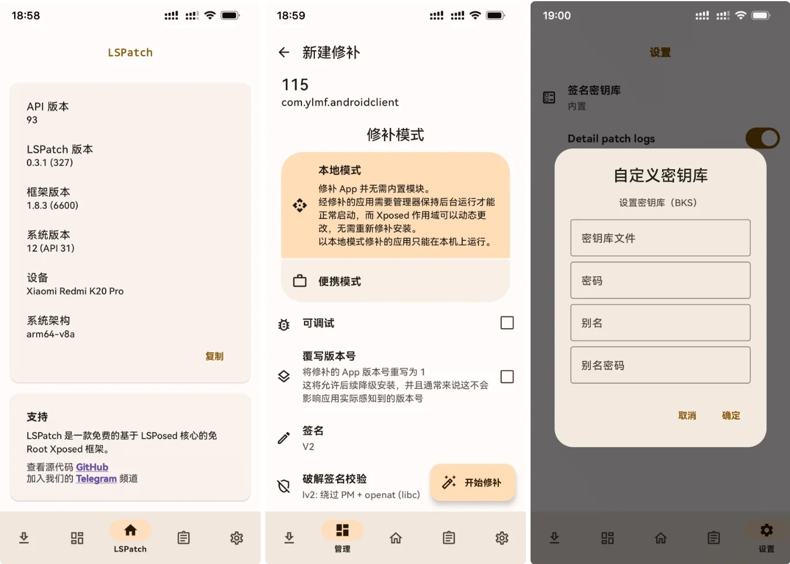
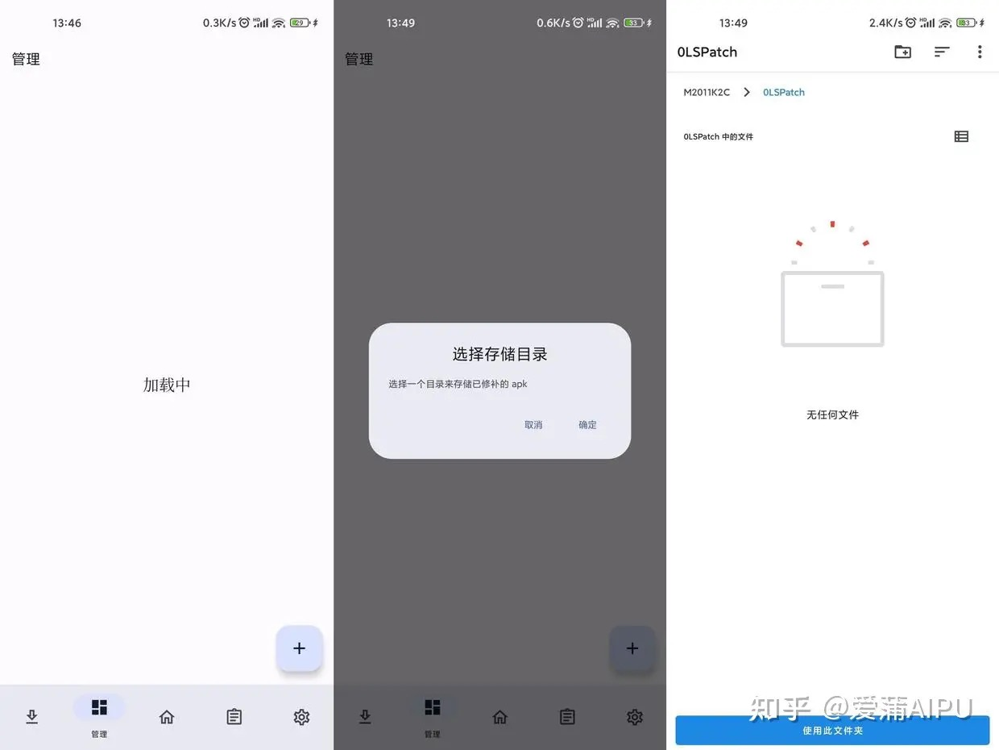
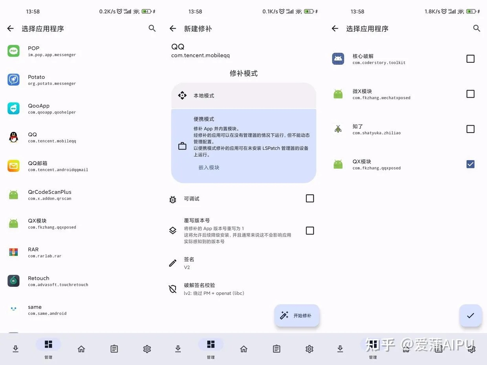
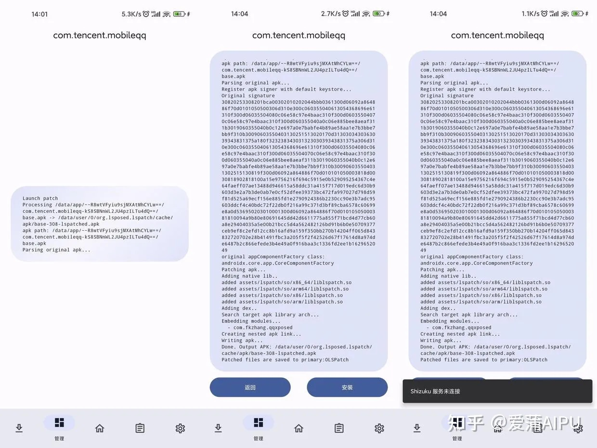
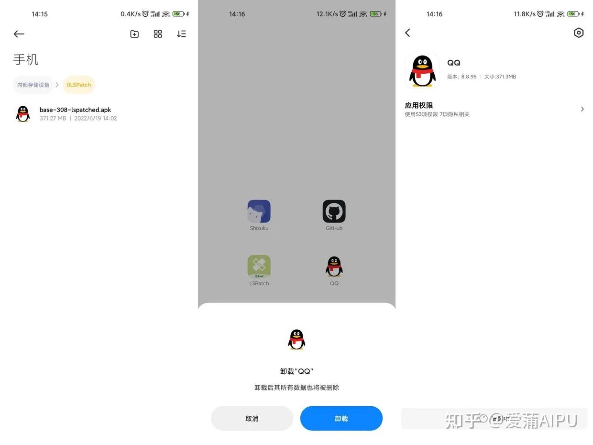
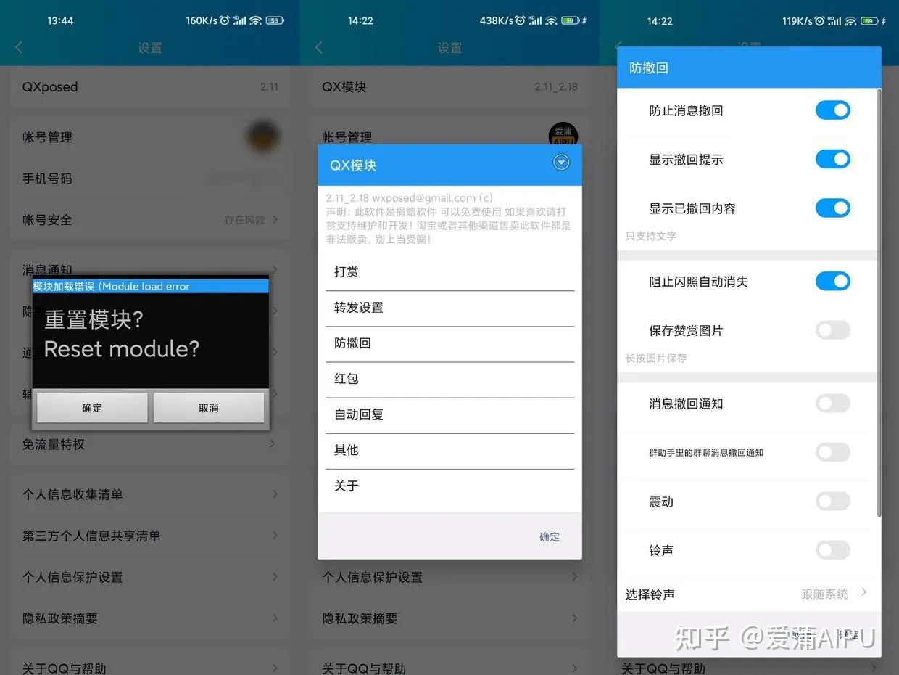

# LSPatch

* `LSPatch`
  * Github
    * https://github.com/LSPosed/LSPatch
  * 概述
    * A non-root Xposed framework extending from LSPosed
      * 基于LSPosed的免Root的Xposed框架软件
  * 特定
    * （安卓手机）无需root（无需解锁BL）
  * 用途=作用
    * 给选定的安卓应用，植入Xposed模块，实现各种插件的功能
  * 图
    * LSPatch
      * 
    * 给QQ安装插件
      * 
      * 
      * 
      * 
      * 
