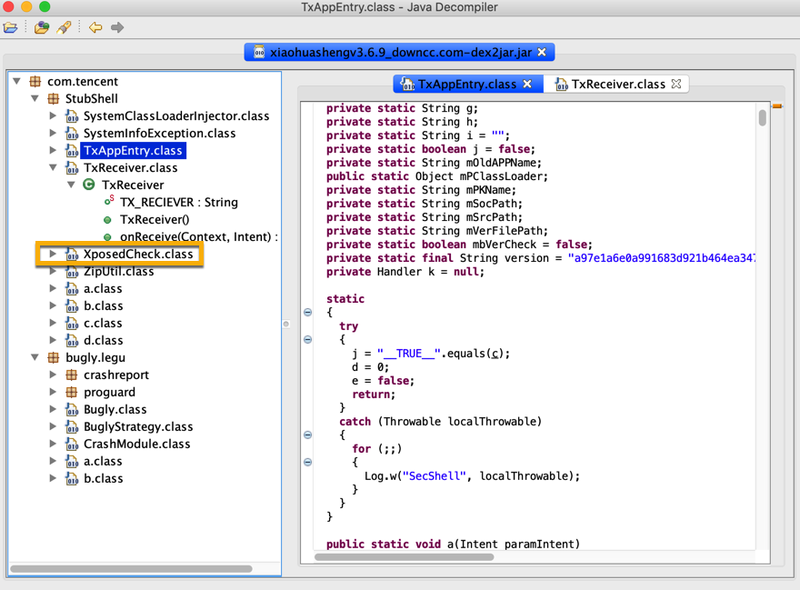
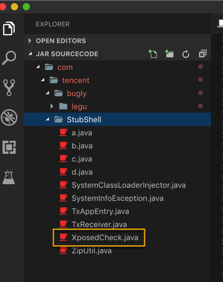

# Xposed心得

TODO：

* 心得
  * 【已解决】Xposed如何hook混淆后的安卓应用中的类名和函数名

---

## 安卓破解可能会涉及到Xposed

注意到：

【已解决】mac版JD-GUI查看并导出jar包的java源代码

和：

【已解决】搞懂安卓app混淆和加固常见做法和相关逻辑

中都有个：`XPosedCheck`

-》看来是安卓apk加固方案内部用到了：去check检测XPosed相关的逻辑

-》说明软件加固的破解中，有些是借助XPosed去破解安卓的

-》实际情况的确也是，XPosed之类的框架，是帮助破解安卓的利器
